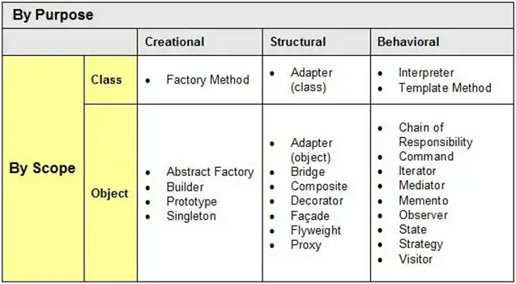
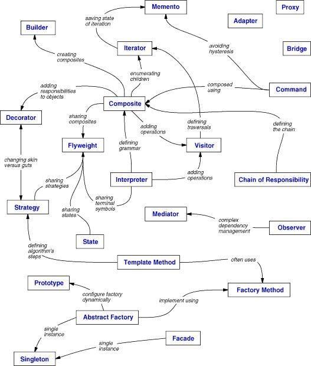

# DesignPatterns

# Obsah
- [Úvod](#_toc149219478)
  - [Co je návrhový vzor?](#_toc149219479)
  - [Z čeho se vzor skládá?](#_toc149219480)
- [SOLID Design Principles](#_toc149219481)
  - [S – Single Responsibility Principle](#_toc149219482)
  - [O – Open/Closed Principle](#_toc149219483)
  - [L – Liskov Substitution Principle](#_toc149219484)
  - [I – Interface Segregation Principle](#_toc149219485)
  - [D – Dependency Inversion Principle](#_toc149219486)
- [Gang of Four (GoF) Návrhové vzory](#_toc149219487)
  - [Factory Method (Tovární metoda)](#_factoryMethod)
  - [Abstract Factory (Abstraktní továrna)](#_abstractFactory)
  - [Builder (Stavitel)](#_builder)
  - [Prototype (Prototyp)](#_prototype)
  - [Singleton (Jedináček)](#_singleton)

# Úvod
## Co je návrhový vzor?
- **Návrhové vzory** jsou typická **řešení** běžně se **vyskytujících problémů** při návrhu softwaru. 
- Jsou jako **předpřipravené plány**, které si **můžete přizpůsobit** tak, abyste **vyřešili** **opakující** se **problém** návrhu ve vašem kódu.

Nemůžete jen tak najít vzor a zkopírovat ho do svého programu, jako je tomu u hotových funkcí nebo knihoven. Vzor není konkrétní kus kódu, ale obecný koncept řešení určitého problému. Můžete se řídit detaily vzoru a implementovat řešení, které odpovídá realitě vašeho vlastního programu.
## Z čeho se vzor skládá?
Většina vzorů je popsána velmi formálně, aby je lidé mohli reprodukovat v mnoha kontextech. Zde jsou části, které se obvykle vyskytují v popisu vzoru:

- Jméno vzoru – Zažité pojmenování, kterým se odkazujeme při návrhu
- Problém – Popis typické situace, kde je užitečné použití vzoru
- Řešení – Popis použití návrhového vzoru
- Důsledky – Popis dopadů při použití vzoru, výhody, nevýhody

# SOLID Design Principles
**Vývojová metodologie pro vývoj OOP**

**SOLID je sada pěti principů pro psaní kódu v objektově orientovaných jazycích**
## [S – Single Responsibility Principle](https://github.com/leifert/DesignPatterns/tree/master/SOLID/SingleResponsibilityPrinciple)
- Každá třída by měla dělat jenom jednu věc
- Neměli bychom psát příliš složité třídy
## [O – Open/Closed Principle](https://github.com/leifert/DesignPatterns/tree/master/SOLID/Open-ClosedPrinciple)
Třídy (moduly) by měly být:

- **Otevřené pro rozšiřování**
- **Uzavřené pro změny**

Polymorfní princip

- Abstraktní třída nebo interface definuje rozhraní a nemění se
- Implementace lze přidávat podle potřeby
## [L – Liskov Substitution Principle](https://github.com/leifert/DesignPatterns/tree/master/SOLID/LiskovSubstitutionPrinciple)
Správné použití dědičnosti

- **Potomek by měl rozšiřovat schopnosti rodiče** (Potomek by měl umět vše co rodič, případně i něco navíc)
- **Rodičovská třída tudíž může být nahrazena svým potomkem**
## [I – Interface Segregation Principle](https://github.com/leifert/DesignPatterns/tree/master/SOLID/InterfaceSegregationPrinciple)
Jednoduchá, jednoúčelová rozhraní

- **Nevytvářejte složitá rozhraní**, ale raději vytvářejte **více jednoúčelových rozhraní**
## [D – Dependency Inversion Principle](https://github.com/leifert/DesignPatterns/tree/master/SOLID/DependencyInversionPrinciple)
- **Třída by neměla sama řídit životní cyklus svých závislostí**
- Měla by je dostat **zvenčí**, typicky jako parametr konstruktoru
- Pokud možno jako **interface**, ne konkrétní třídu, nepotřebujeme znát konkrétní implementaci

# Gang of Four (GoF) Návrhové vzory
Kniha **Design Patterns: [Elements of Reusable Object-Oriented Software](https://www.amazon.com/gp/product/0201633612/)** byla poprvé vydána v roce 1994 a je jednou z nejoblíbenějších knih pro výuku návrhových vzorů. Autory knihy jsou Erich Gamma, Richard Helm, Ralph Johnson a John Vlissides. Kniha obsahovala 23 vzorů řešících různé problémy objektově orientovaného návrhu a velmi rychle se stala bestsellerem. Kvůli jejímu dlouhému názvu jí lidé začali říkat "the book by the gang of four", což se brzy zkrátilo na prosté "the GoF book" nebo "GoF Design Patterns".

Návrhové vzory GoF jsou rozděleny do tří kategorií:

- **Creational (Tvořící vzory):** Návrhové vzory, které se zabývají vytvářením objektu.
- **Structural (Strukturální vzory):** Návrhové vzory v této kategorii se zabývají strukturou tříd, například dědičností a kompozicí.
- **Behavioral (Vzory chování):** Tento typ návrhových vzorů poskytuje řešení pro lepší interakci mezi objekty, jak zajistit menší závislost a flexibilitu pro snadné rozšiřování v budoucnosti.

  

  

**Creational:**

- **Factory Method** (Tovární metoda) – Poskytuje rozhraní pro vytváření objektů v nadtřídě, ale umožňuje podtřídám měnit typ vytvářených objektů.

- **Abstract Factory** (Abstraktní továrna) – Umožňuje jednotně vytvářet skupiny spolu souvisejících objektů, aniž by bylo nutné zadávat jejich konkrétní třídy.

- **Builder** (Stavitel) – Umožňuje vytvářet složité objekty krok za krokem. Vzor umožňuje vytvářet různé typy a reprezentace objektu pomocí stejného konstrukčního kódu.

- **Prototype** (Prototyp, Klon) – Plně inicializována instance, která slouží jako vzor pro zkopírování

- **Singleton** (Jedináček) – Třída, která má mít v programu pouze jedinou instanci

**Structural:**

- **Adapter** (Adaptér) – Umožňuje spolupráci objektů s nekompatibilními rozhraními.

- **Bridge** (Most) – Umožňuje rozdělit velkou třídu nebo sadu úzce souvisejících tříd do dvou samostatných hierarchií – abstrakce a implementace, které lze vyvíjet nezávisle na sobě.

- **Composite** (Strom, Složenina) – Umožňuje skládat objekty do stromových struktur a následně s nimi pracovat, jako by se jednalo o jednotlivé objekty.

- **Decorator** (Dekorátor) – Umožňuje připojit k objektům nové chování umístěním těchto objektů do speciálních obalových objektů, které obsahují daná chování.

- **Facade** (Fasáda) – Poskytuje zjednodušené rozhraní ke knihovně, frameworku nebo jiné složité skupině tříd.

- **Flyweight** (Muší váha) – Umožňuje vměstnat více objektů do dostupného množství paměti RAM sdílením společných částí stavu mezi více objekty namísto uchovávání všech dat v každém objektu.

- **Proxy** (Zástupce) – Umožňuje poskytnout náhradu nebo zástupný symbol pro jiný objekt. Proxy řídí přístup k původnímu objektu, což vám umožňuje provést něco před nebo poté, co se požadavek dostane k původnímu objektu.

**Behavioral:**

- **Chain of responsibility** (Zřetězení zodpovědnosti) – Umožňuje předávat požadavky v řetězci obslužných rutin. Po obdržení žádosti se každý zpracovatel rozhodne, zda žádost zpracuje, nebo ji předá dalšímu zpracovateli v řetězci.

- **Command** (Příkaz) – Změní požadavek na samostatný objekt, který obsahuje všechny informace o požadavku. Tato transformace vám umožňuje předávat požadavky jako argumenty metody, odložit nebo zařadit provedení požadavku do fronty.

- **Iterator** (Iterátor) – Umožňuje jednoduché lineární procházení kolekcemi, aniž bychom museli znát vnitřní strukturu těchto kolekcí.

- **Mediator** (Prostředník) – Umožňuje snížit chaotické závislosti mezi objekty. Vzor omezuje přímou komunikaci mezi objekty a nutí je spolupracovat pouze prostřednictvím objektu prostředníka.

- **Memento** (Památka) – Umožňuje uložit a obnovit předchozí stav objektu, aniž by byly odhaleny podrobnosti jeho implementace.

- **Observer** (Pozorovatel) – Umožňuje objektu spravovat řadu pozorovatelů, kteří reagují na změnu jeho stavu voláním svých metod.
- **State** (Stav) – Umožňuje objektu změnit své chování, když se změní jeho vnitřní stav. Vypadá to, jako by objekt změnil svou třídu.

- **Strategy** (Strategie) – Umožňuje za běhu aplikace vyměnit algoritmus za jiný bez nutnosti změny kódu programu. Každý algoritmus je ve samostatné třídě.
- **Template** **method** (Šablonová metoda) – Definuje kostru algoritmu v nadtřídě, ale umožňuje podtřídám přepsat konkrétní kroky algoritmu beze změny jeho struktury.

- **Visitor** (Návštěvník) – Umožňuje oddělit algoritmy od objektů, na kterých pracují.

# [Factory Method (Tovární Metoda)](https://github.com/leifert/DesignPatterns/tree/master/GoF/Creational/FactoryMethod)

Vzor Tovární metoda navrhuje nahradit přímé volání konstrukce objektu (pomocí operátoru new) voláním speciální tovární metody. Objekty se stále vytvářejí pomocí operátoru new, ale ten se volá zevnitř tovární metody. Objekty vrácené tovární metodou se často označují jako produkty.

  

# [Builder (Stavitel)](https://github.com/leifert/DesignPatterns/tree/master/GoF/Creational/Builder)
**Problém**

Představte si složitý objekt, který vyžaduje pracnou postupnou inicializaci mnoha polí a vnořených objektů. Takový inicializační kód je obvykle pohřben uvnitř monstrózního konstruktoru se spoustou parametrů. Nebo jsou vytvořeny podtřídy pro každou možnou konfiguraci objektu.

**Řešení**

Vzor Builder navrhuje, abyste extrahovali kód konstrukce objektu z jeho vlastní třídy a přesunuli jej do samostatných objektů nazývaných stavitelé.

  

# [Singleton (Jedináček)](https://github.com/leifert/DesignPatterns/tree/master/GoF/Creational/Singleton)
**Problém**

Zajistěte, aby třída měla pouze jednu instanci.

**Řešení**

- Udělejte výchozí konstruktor soukromým, aby ostatní objekty nemohly používat operátor new s třídou Singleton.
- Vytvořte statickou metodu GetInstance, která bude fungovat jako konstruktor. Tato metoda zavolá soukromý konstruktor pro vytvoření objektu a uloží jej do statické proměnné. Všechna následující volání této metody vracejí objekt uložený v mezipaměti.

  

