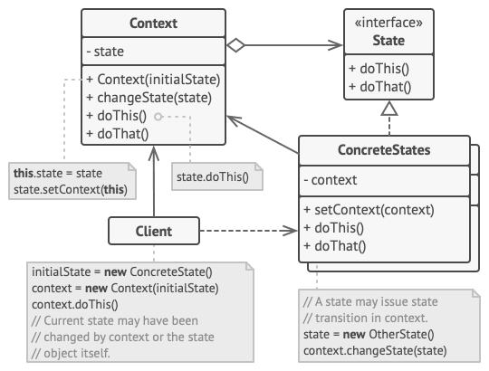

# Návrhové vzory

## Co je návrhový vzor?
- **Návrhové vzory** jsou typická **řešení** běžně se **vyskytujících problémů** při návrhu softwaru. 
- Jsou jako **předpřipravené plány**, které si **můžete přizpůsobit** tak, abyste **vyřešili** **opakující** se **problém** návrhu ve vašem kódu.

Nemůžete jen tak najít vzor a zkopírovat ho do svého programu, jako je tomu u hotových funkcí nebo knihoven. Vzor není konkrétní kus kódu, ale obecný koncept řešení určitého problému. Můžete se řídit detaily vzoru a implementovat řešení, které odpovídá realitě vašeho vlastního programu.
## Z čeho se vzor skládá?
Většina vzorů je popsána velmi formálně, aby je lidé mohli reprodukovat v mnoha kontextech. Zde jsou části, které se obvykle vyskytují v popisu vzoru:

- Jméno vzoru – Zažité pojmenování, kterým se odkazujeme při návrhu
- Problém – Popis typické situace, kde je užitečné použití vzoru
- Řešení – Popis použití návrhového vzoru
- Důsledky – Popis dopadů při použití vzoru, výhody, nevýhody


# Gang of Four (GoF) Návrhové vzory
Kniha **Design Patterns: Elements of Reusable Object-Oriented Software** byla poprvé vydána v roce 1994 a je jednou z nejoblíbenějších knih pro výuku návrhových vzorů. Autory knihy jsou Erich Gamma, Richard Helm, Ralph Johnson a John Vlissides. Kniha obsahovala 23 vzorů řešících různé problémy objektově orientovaného návrhu a velmi rychle se stala bestsellerem. Kvůli jejímu dlouhému názvu jí lidé začali říkat "the book by the gang of four", což se brzy zkrátilo na prosté "the GoF book" nebo "GoF Design Patterns".

Návrhové vzory GoF jsou rozděleny do tří kategorií:

- **Creational (Tvořící vzory):** Návrhové vzory, které se zabývají vytvářením objektu.
- **Structural (Strukturální vzory):** Návrhové vzory v této kategorii se zabývají strukturou tříd, například dědičností a kompozicí.
- **Behavioral (Vzory chování):** Tento typ návrhových vzorů poskytuje řešení pro lepší interakci mezi objekty, jak zajistit menší závislost a flexibilitu pro snadné rozšiřování v budoucnosti.

<p>
  
</p>

<p>
  
</p>

<p>
  
</p>

**Creational:**

- **Factory Method** (Tovární metoda) – Poskytuje rozhraní pro vytváření objektů v nadtřídě, ale umožňuje podtřídám měnit typ vytvářených objektů.

- **Abstract Factory** (Abstraktní továrna) – Umožňuje jednotně vytvářet skupiny spolu souvisejících objektů, aniž by bylo nutné zadávat jejich konkrétní třídy.

- **Builder** (Stavitel) – Umožňuje vytvářet složité objekty krok za krokem. Vzor umožňuje vytvářet různé typy a reprezentace objektu pomocí stejného konstrukčního kódu.

- **Prototype** (Prototyp, Klon) – Plně inicializována instance, která slouží jako vzor pro zkopírování

- **Singleton** (Jedináček) – Třída, která má mít v programu pouze jedinou instanci

**Structural:**

- **Adapter** (Adaptér) – Umožňuje spolupráci objektů s nekompatibilními rozhraními.

- **Bridge** (Most) – Umožňuje rozdělit velkou třídu nebo sadu úzce souvisejících tříd do dvou samostatných hierarchií – abstrakce a implementace, které lze vyvíjet nezávisle na sobě.

- **Composite** (Strom, Složenina) – Umožňuje skládat objekty do stromových struktur a následně s nimi pracovat, jako by se jednalo o jednotlivé objekty.

- **Decorator** (Dekorátor) – Umožňuje připojit k objektům nové chování umístěním těchto objektů do speciálních obalových objektů, které obsahují daná chování.

- **Facade** (Fasáda) – Poskytuje zjednodušené rozhraní ke knihovně, frameworku nebo jiné složité skupině tříd.

- **Flyweight** (Muší váha) – Umožňuje vměstnat více objektů do dostupného množství paměti RAM sdílením společných částí stavu mezi více objekty namísto uchovávání všech dat v každém objektu.

- **Proxy** (Zástupce) – Umožňuje poskytnout náhradu nebo zástupný symbol pro jiný objekt. Proxy řídí přístup k původnímu objektu, což vám umožňuje provést něco před nebo poté, co se požadavek dostane k původnímu objektu.

**Behavioral:**

- **Chain of responsibility** (Zřetězení zodpovědnosti) – Umožňuje předávat požadavky v řetězci obslužných rutin. Po obdržení žádosti se každý zpracovatel rozhodne, zda žádost zpracuje, nebo ji předá dalšímu zpracovateli v řetězci.

- **Command** (Příkaz) – Změní požadavek na samostatný objekt, který obsahuje všechny informace o požadavku. Tato transformace vám umožňuje předávat požadavky jako argumenty metody, odložit nebo zařadit provedení požadavku do fronty.

- **Iterator** (Iterátor) – Umožňuje jednoduché lineární procházení kolekcemi, aniž bychom museli znát vnitřní strukturu těchto kolekcí.

- **Mediator** (Prostředník) – Umožňuje snížit chaotické závislosti mezi objekty. Vzor omezuje přímou komunikaci mezi objekty a nutí je spolupracovat pouze prostřednictvím objektu prostředníka.

- **Memento** (Památka) – Umožňuje uložit a obnovit předchozí stav objektu, aniž by byly odhaleny podrobnosti jeho implementace.

- **Observer** (Pozorovatel) – Umožňuje objektu spravovat řadu pozorovatelů, kteří reagují na změnu jeho stavu voláním svých metod.
- **State** (Stav) – Umožňuje objektu změnit své chování, když se změní jeho vnitřní stav. Vypadá to, jako by objekt změnil svou třídu.

- **Strategy** (Strategie) – Umožňuje za běhu aplikace vyměnit algoritmus za jiný bez nutnosti změny kódu programu. Každý algoritmus je ve samostatné třídě.
- **Template** **method** (Šablonová metoda) – Definuje kostru algoritmu v nadtřídě, ale umožňuje podtřídám přepsat konkrétní kroky algoritmu beze změny jeho struktury.

- **Visitor** (Návštěvník) – Umožňuje oddělit algoritmy od objektů, na kterých pracují.

# 1. Factory method

Tovární metoda (Factory Method) je návrhový vzor, který je součástí skupiny tzv. "creational" vzorů (tj. vzorů pro tvorbu objektů) v softwarovém inženýrství. 

**Vzor Factory Method definuje rozhraní pro vytvoření objektu, ale nechává podtřídy rozhodnout, kterou třídu instancovat.**
Metoda Factory umožňuje třídě odložit instanciaci na podtřídy, což je užitečné pro konstrukci jednotlivých objektů pro konkrétní účel, aniž by zadavatel znal konkrétní instancovanou třídu. 
To umožňuje zavést nové třídy bez úpravy kódu, protože nová třída implementuje pouze rozhraní, takže ji klient může použít.

<p>
  
</p>

```csharp
// Rozhraní Product
public interface IProduct {
	void DoStuff();
}

// Konkrétní produkty
public class ConcreteProductA : IProduct {
	public void DoStuff() {
		Console.WriteLine("Using Product A");
	}
	
public void DoStuff() {
	Console.WriteLine("Using Product B");
}

// Abstraktní třída Creator deklarující factory metodu
public abstract class Creator {
	public abstract IProduct CreateProduct();

	public void SomeOperation() {
		IProduct product = CreateProduct();
		// operace s vytvořeným produktem
		product.DoStuff();
	}
}

// Konkrétní podtřídy implementující factory metodu
public class ConcreteCreatorA : Creator {
	public override IProduct CreateProduct() {
		return new ConcreteProductA();
	}
}

public class ConcreteCreatorB : Creator {
	public override IProduct CreateProduct() {
		return new ConcreteProductB();
	}
}

// Použití factory metody
internal class Program {
	static void Main(string[] args) {

		Creator creatorA = new ConcreteCreatorA();
		creatorA.SomeOperation();// Output: Using Product A

		Creator creatorB = new ConcreteCreatorB();
		creatorB.SomeOperation();// Output: Using Product B
	}
}
```
## 1.1 Injectable Factory method

Jedna z největších výhod použití injectable tovární metody je ta, že samotné implementace služeb, které jsou vráceny tovární metodou, mohou mít vlastní závislosti, které jsou spravovány kontejnerem závislostí (Dependency Injection, DI). To zajišťuje, že všechny závislosti těchto služeb jsou správně injektovány a spravovány.

1. Registrace služeb do IServiceCollection
```csharp
public static class PaymentFactory
{
    public static IPaymentService? AddPaymentFactory(this IServiceCollection services)
    {
        // register all implementation of IPayment interface
        services.AddScoped<CreditCardPaymentService>();
        services.AddScoped<PayPalPaymentService>();
        services.AddScoped<GooglePayPaymentService>();

        //register a factory function that accepts a PaymentMethod parameter and returns the corresponding IPaymentService implementation
        services.AddTransient<Func<PaymentMethod, IPaymentService?>>(serviceProvider => key =>
        {
            switch (key)
            {
                case PaymentMethod.CreditCard:
                    return serviceProvider.GetService<CreditCardPaymentService>();

                case PaymentMethod.PayPal:
                    return serviceProvider.GetService<PayPalPaymentService>();

                case PaymentMethod.GooglePay:
                    return serviceProvider.GetService<GooglePayPaymentService>();

                default:
                    throw new NotSupportedException(
                        $"{key} is not currently supported as a payment method."
                    );
            }
        });

        return null;
    }
}
//Program.cs
builder.Services.AddPaymentFactory();
```

2. Vložení factory method  pomocí závislostí (Dependency Injection):
```csharp
[Route("api/v1/[controller]")]
[ApiController]
public class PaymentsController : Controller
{
    private readonly Func<PaymentMethod, IPaymentService?> _paymentFactory;

    public PaymentsController(Func<PaymentMethod, IPaymentService?> paymentFactory)
    {
        _paymentFactory = paymentFactory;
    }

    [HttpPost("makePayment")]
    public IActionResult PayAsync([FromBody] PaymentRequestDto request)
    {
        IPaymentService? payment = _paymentFactory(request.PaymentMethod);

        if (payment is null)
        {
            return BadRequest("Unsupported payment method.");
        }
        string result = payment.Pay(request.Amount);

        return Ok(result);
    }
}
```
# 2. Abstract Factory

Návrhový vzor Abstract Factory, známý také jako abstraktní továrna, umožňuje **vytvářet rodiny objektů souvisejících tříd bez nutnosti specifikovat jejich konkrétní implementační třídy**. Umožňuje klientovi vytvořit objekty bez uvedení konkrétních tříd, což zajišťuje, že klient nezná žádné konkrétní implementace, ale pouze rozhraní.
#### Abstract Factory se používá v situacích, kdy:
- Chceme vytvářet rodiny objektů souvisejících tříd, aniž bychom museli specifikovat jejich konkrétní implementační třídy.
- Systém má více variant produktů a chceme klientům umožnit pracovat s produkty z vybrané varianty bez nutnosti znát jejich implementaci.
- Chceme oddělit klientský kód od implementace objektů.
#### Jak funguje Abstract Factory
1. **AbstractProducts**: Rozhraní deklarují metody pro produkty.
2. **ConcreteProducts**: Konkrétní implementace abstract produktů.
3. **AbstractFactory**: Deklaruje metody pro vytváření produktů.
4. **ConcreteFactories**: Implementují AbstractFactory a vytvářejí konkrétní produkty.
5. **Client**: Používá AbstractFactory k vytvoření produktů bez znalosti jejich konkrétních implementací.

<p>
  
</p>

### 2.1 Konkrétní příklad
Jednoduchý příklad, kde máme systém pro vykreslování GUI komponent. Chceme mít možnost vytvořit komponenty pro různé platformy (např. Windows, Mac).
```csharp
// Abstract Product A
public interface IButton
{
    void Paint();
}

// Abstract Product B
public interface ICheckbox
{
    void Paint();
}

// Concrete Product A1
public class WindowsButton : IButton
{
    public void Paint()
    {
        Console.WriteLine("Rendering a button in a Windows style.");
    }
}

// Concrete Product A2
public class MacButton : IButton
{
    public void Paint()
    {
        Console.WriteLine("Rendering a button in a Mac style.");
    }
}

// Concrete Product B1
public class WindowsCheckbox : ICheckbox
{
    public void Paint()
    {
        Console.WriteLine("Rendering a checkbox in a Windows style.");
    }
}

// Concrete Product B2
public class MacCheckbox : ICheckbox
{
    public void Paint()
    {
        Console.WriteLine("Rendering a checkbox in a Mac style.");
    }
}

// Abstract Factory
public interface IGUIFactory
{
    IButton CreateButton();
    ICheckbox CreateCheckbox();
}

// Concrete Factory 1
public class WindowsFactory : IGUIFactory
{
    public IButton CreateButton()
    {
        return new WindowsButton();
    }

    public ICheckbox CreateCheckbox()
    {
        return new WindowsCheckbox();
    }
}

// Concrete Factory 2
public class MacFactory : IGUIFactory
{
    public IButton CreateButton()
    {
        return new MacButton();
    }

    public ICheckbox CreateCheckbox()
    {
        return new MacCheckbox();
    }
}

// Client
public class Application
{
    private readonly IButton _button;
    private readonly ICheckbox _checkbox;

    public Application(IGUIFactory factory)
    {
        _button = factory.CreateButton();
        _checkbox = factory.CreateCheckbox();
    }

    public void Paint()
    {
        _button.Paint();
        _checkbox.Paint();
    }
}

```
Použití
```csharp
class Program
{
    static void Main(string[] args)
    {
        // Using Windows Factory
        IGUIFactory windowsFactory = new WindowsFactory();
        Application windowsApp = new Application(windowsFactory);
        windowsApp.Paint();

        // Using Mac Factory
        IGUIFactory macFactory = new MacFactory();
        Application macApp = new Application(macFactory);
        macApp.Paint();
    }
}
```

# 3. Builder
Stavitel je návrhový vzor, který umožňuje konstruovat složité objekty krok za krokem. Vzor umožňuje vytvářet různé typy a reprezentace objektu pomocí stejného konstrukčního kódu.
<p>  </p>

```csharp
// Car class
public class Car
{
    public int Seats { get; set; }
    public string Engine { get; set; }
    public bool TripComputer { get; set; }
    public bool GPS { get; set; }
}

// Manual class
public class Manual
{
    public string Description { get; set; }
}

// Builder interface
public interface IBuilder
{
    void Reset();
    void SetSeats(int number);
    void SetEngine(string engine);
    void SetTripComputer(bool hasTripComputer);
    void SetGPS(bool hasGPS);
}

// Concrete CarBuilder
public class CarBuilder : IBuilder
{
    private Car car;

    public CarBuilder()
    {
        this.Reset();
    }

    public void Reset()
    {
        this.car = new Car();
    }

    public void SetSeats(int number)
    {
        this.car.Seats = number;
    }

    public void SetEngine(string engine)
    {
        this.car.Engine = engine;
    }

    public void SetTripComputer(bool hasTripComputer)
    {
        this.car.TripComputer = hasTripComputer;
    }

    public void SetGPS(bool hasGPS)
    {
        this.car.GPS = hasGPS;
    }

    public Car GetProduct()
    {
        Car product = this.car;
        this.Reset();
        return product;
    }
}

// Concrete CarManualBuilder
public class CarManualBuilder : IBuilder
{
    private Manual manual;

    public CarManualBuilder()
    {
        this.Reset();
    }

    public void Reset()
    {
        this.manual = new Manual();
    }

    public void SetSeats(int number)
    {
        this.manual.Description += $"Seats: {number}\n";
    }

    public void SetEngine(string engine)
    {
        this.manual.Description += $"Engine: {engine}\n";
    }

    public void SetTripComputer(bool hasTripComputer)
    {
        this.manual.Description += $"Trip Computer: {(hasTripComputer ? "Yes" : "No")}\n";
    }

    public void SetGPS(bool hasGPS)
    {
        this.manual.Description += $"GPS: {(hasGPS ? "Yes" : "No")}\n";
    }

    public Manual GetProduct()
    {
        Manual product = this.manual;
        this.Reset();
        return product;
    }
}

// Director
public class Director
{
    private IBuilder builder;

    public void SetBuilder(IBuilder builder)
    {
        this.builder = builder;
    }

    public void ConstructSportsCar()
    {
        builder.Reset();
        builder.SetSeats(2);
        builder.SetEngine("Sport Engine");
        builder.SetTripComputer(true);
        builder.SetGPS(true);
    }

    public void ConstructSUV()
    {
        // Implement SUV construction
    }
}

// Client code
public class Application
{
    public void MakeCar()
    {
        Director director = new Director();

        CarBuilder carBuilder = new CarBuilder();
        director.SetBuilder(carBuilder);
        director.ConstructSportsCar();
        Car car = carBuilder.GetProduct();
        
        CarManualBuilder manualBuilder = new CarManualBuilder();
        director.SetBuilder(manualBuilder);
        director.ConstructSportsCar();
        Manual manual = manualBuilder.GetProduct();
    }
}
```

## 3.1 Fluent builder
Tento vzor je variací klasického Builder vzoru a je specifický tím, že umožňuje vytváření objektů pomocí metody řetězení (chaining methods). To znamená, že metody návratového typu vracejí instanci objektu, což umožňuje volání dalších metod na stejném objektu plynule (fluentně).
```csharp
// Car class
public class Car
{
    public int Seats { get; set; }
    public string Engine { get; set; }
    public bool TripComputer { get; set; }
    public bool GPS { get; set; }

    public override string ToString()
    {
        return $"Car with {Seats} seats, {Engine} engine, Trip Computer: {TripComputer}, GPS: {GPS}";
    }
}

// Fluent CarBuilder
public class CarBuilder
{
    private Car car = new Car();

    public CarBuilder Reset()
    {
        car = new Car();
        return this;
    }

    public CarBuilder SetSeats(int number)
    {
        car.Seats = number;
        return this;
    }

    public CarBuilder SetEngine(string engine)
    {
        car.Engine = engine;
        return this;
    }

    public CarBuilder SetTripComputer(bool hasTripComputer)
    {
        car.TripComputer = hasTripComputer;
        return this;
    }

    public CarBuilder SetGPS(bool hasGPS)
    {
        car.GPS = hasGPS;
        return this;
    }

    public Car Build()
    {
        return car;
    }
}

// Client code
public class Application
{
    public void MakeCar()
    {
        CarBuilder builder = new CarBuilder();
        
        Car sportsCar = builder
            .Reset()
            .SetSeats(2)
            .SetEngine("Sport Engine")
            .SetTripComputer(true)
            .SetGPS(true)
            .Build();
        
        Console.WriteLine(sportsCar);

        Car suv = builder
            .Reset()
            .SetSeats(5)
            .SetEngine("SUV Engine")
            .SetTripComputer(false)
            .SetGPS(true)
            .Build();
        
        Console.WriteLine(suv);
    }
}

```

# 4. Prototype

Tento vzor umožňuje **vytváření nových objektů kopírováním již existujících instancí,** čímž se zjednodušuje a zrychluje proces tvorby objektů, zvláště pokud inicializace nových objektů je nákladná nebo složitá.

<p>  </p>

### 4.1 Copy consctructor
```csharp
// Address class
public class Address
{
	public string StreetName;
	public int HouseNumber;

	public Address(string streetName, int houseNumber)
	{
		StreetName = streetName;
		HouseNumber = houseNumber;
	}

	public Address(Address otherAddress)
	{
		StreetName=otherAddress.StreetName;
		HouseNumber=otherAddress.HouseNumber;
	}

	public override string ToString()
	{
		return $"{nameof(StreetName)}: {StreetName}, {nameof(HouseNumber)}: {HouseNumber}";
	}
}

// Person class
public class Person
{
	public string[] Names;
	public Address Address;

	public Person(string[]names, Address address)
	{
		Names = names;
		Address = address;
	}
	public Person(Person otherPerson)
	{
		Names=otherPerson.Names;
		Address=new Address(otherPerson.Address);
	}

	public override string ToString()
	{
		return $"{nameof(Names)}: {string.Join(" ",Names)}, {nameof(Address)}: {Address}";
	}
}

// Client code
static void Main(string[] args)
{
	Person john = new Person(
		new[] { "John", "Smith" },
		new Address("London Road", 10)
		);

	var jane = new Person(john);
	jane.Address.HouseNumber = 321;
	Console.WriteLine(john);
	Console.WriteLine(jane);
	//Names: John Smith, Address: StreetName: London Road, HouseNumber: 10
	//Names: John Smith, Address: StreetName: London Road, HouseNumber: 321
}
```

### 4.2 ICloneable
```csharp
// Address class implementing the ICloneable interface for cloning
public class Address : ICloneable
{
	public string StreetName;
	public int HouseNumber;

	public Address(string streetName, int houseNumber)
	{
		StreetName = streetName;
		HouseNumber = houseNumber;
	}

	public object Clone()
	{
		return new Address(StreetName, HouseNumber);
	}

	public override string ToString()
	{
		return $"{nameof(StreetName)}: {StreetName}, {nameof(HouseNumber)}: {HouseNumber}";
	}
}

// Person class implementing the ICloneable interface for cloning
public class Person : ICloneable
{
	public string[] Names;
	public Address Address;

	public Person(string[]names, Address address)
	{
		Names = names;
		Address = address;
	}

	public object Clone()
	{
		return new Person(Names, (Address)Address.Clone());  
	}

	public override string ToString()
	{
		return $"{nameof(Names)}: {string.Join(" ",Names)}, {nameof(Address)}: {Address}";
	}
}

// Client code
static void Main(string[] args)
{
	Person john = new Person(
		new[] { "John", "Smith" },
		new Address("London Road", 10)
		);

	var jane = (Person)john.Clone();
	jane.Address.HouseNumber = 321;

	//shallow copy
	Console.WriteLine(john);
	Console.WriteLine(jane);
	//Names: John Smith, Address: StreetName: London Road, HouseNumber: 321
	//Names: John Smith, Address: StreetName: London Road, HouseNumber: 321

	//deep copy add to Address : ICloneable
	Console.WriteLine(john);
	Console.WriteLine(jane);
	//Names: John Smith, Address: StreetName: London Road, HouseNumber: 321
	//Names: John Smith, Address: StreetName: London Road, HouseNumber: 10
}

```

### 4.3 ExplicitDeepCopyInterface
```csharp
// Interface defining a prototype pattern with a deep copy method
public interface IPrototype<T>
{
	T DeepCopy();
}

// Address class implementing the IPrototype interface for deep copying
public class Address : IPrototype<Address>
{
	public string StreetName;
	public int HouseNumber;

	public Address(string streetName, int houseNumber)
	{
		StreetName = streetName;
		HouseNumber = houseNumber;
	}

	public Address DeepCopy()
	{
		return new Address(StreetName, HouseNumber);
	}

	public override string ToString()
	{
		return $"{nameof(StreetName)}: {StreetName}, {nameof(HouseNumber)}: {HouseNumber}";
	}
}

// Person class implementing the IPrototype interface for deep copying
public class Person : IPrototype<Person>
{
	public string[] Names;
	public Address Address;

	public Person(string[]names, Address address)
	{
		Names = names;
		Address = address;
	}

	public Person DeepCopy()
	{
		return new Person(Names, Address.DeepCopy());
	}

	public override string ToString()
	{
		return $"{nameof(Names)}: {string.Join(" ",Names)}, {nameof(Address)}: {Address}";
	}
}

//Client code
static void Main(string[] args)
{
	Person john = new Person(
	   new[] { "John", "Smith" },
	   new Address("London Road", 10)
	   );

	var jane = john.DeepCopy();
	jane.Address.HouseNumber = 321;

	Console.WriteLine(john);
	Console.WriteLine(jane);
	//Names: John Smith, Address: StreetName: London Road, HouseNumber: 10
	//Names: John Smith, Address: StreetName: London Road, HouseNumber: 321
}
```
### 4.4 PrototypeThroughSerialization
```csharp
// Extension methods for deep copying objects using binary and XML serialization
public static class ExtensionMethods
{
	public static T DeepCopy<T>(this T self)
	{
		if (!typeof(T).IsSerializable)
		{
			throw new ArgumentException("Class must be marked [Serializable]");
		}
		if (Object.ReferenceEquals(self, null))
		{
			return default(T);
		}
		using (var ms = new MemoryStream())
		{
			var formatter = new BinaryFormatter();
			formatter.Serialize(ms, self);
			ms.Position = 0;
			return (T)formatter.Deserialize(ms);
		}
	}

	public static T DeepCopyXml<T>(this T self)
	{
		using (var ms = new MemoryStream())
		{
			var s = new XmlSerializer(typeof(T));
			s.Serialize(ms, self);
			ms.Position = 0;
			return (T)s.Deserialize(ms);
		}
	}
}

[Serializable]
public class Address
{
	public string StreetName;
	public int HouseNumber;

	public Address()
	{
		
	}
	public Address(string streetName, int houseNumber)
	{
		StreetName = streetName;
		HouseNumber = houseNumber;
	}

	public override string ToString()
	{
		return $"{nameof(StreetName)}: {StreetName}, {nameof(HouseNumber)}: {HouseNumber}";
	}
}
[Serializable]
public class Person
{
	public string[] Names;
	public Address Address;

	public Person(){}
	public Person(string[]names, Address address)
	{
		Names = names;
		Address = address;
	}

	public override string ToString()
	{
		return $"{nameof(Names)}: {string.Join(" ",Names)}, {nameof(Address)}: {Address}";
	}
}

// Client code
static void Main(string[] args)
{
	Person john = new Person(
	  new[] { "John", "Smith" },
	  new Address("London Road", 10)
	  );

	var jane = john.DeepCopy();
	//var jane = john.DeepCopyXml();
	jane.Names[0] = "Jane";
	jane.Address.HouseNumber = 321;

	Console.WriteLine(john);
	Console.WriteLine(jane);
	//Names: John Smith, Address: StreetName: London Road, HouseNumber: 10
	//Names: Jane Smith, Address: StreetName: London Road, HouseNumber: 321
}
```
# 5. Singleton

Singleton je návrhový vzor, který umožňuje zajistit, aby třída měla pouze jednu instanci, a zároveň poskytuje globální přístupový bod k této instanci.

<p>  </p>

### 5.1 Non thread-safe solution
```csharp
public sealed class Singleton
{
	private static Singleton _instance;
	
	private Singleton() { }

	public static Singleton GetInstance()
	{
		if (_instance == null)
		{
			_instance = new Singleton();
		}
		return _instance;
	}

	public void someBusinessLogic()
	{
		// ...
	}
}

// Client code
static void Main(string[] args)
{
	Singleton s1 = Singleton.GetInstance();
	Singleton s2 = Singleton.GetInstance();

	if (s1 == s2)
	{
		Console.WriteLine("Singleton works, both variables contain the same instance.");
	}
	else
	{
		Console.WriteLine("Singleton failed, variables contain different instances.");
	}
}

```
### 5.2 Thread-safe solution
```csharp
public sealed class SingletonThreadSafe
{
    private static SingletonThreadSafe _instance;
    private static readonly object _lock = new object();

    private SingletonThreadSafe() { }

    public static SingletonThreadSafe GetInstance()
    {
		// Double-checked locking: může zlepšit výkon tím, že se vyhne zamykání, pokud instance Singletonu již existuje.
        if (_instance == null)
        {
            lock (_lock)
            {
                if (_instance == null)
                {
                    _instance = new SingletonThreadSafe();
                }
            }
        }
        return _instance;
    }

    public void SomeBusinessLogic()
    {
        // ...
    }
}

// Client code
class Program
{
    static void Main(string[] args)
    {
        SingletonThreadSafe s1 = SingletonThreadSafe.GetInstance();
        SingletonThreadSafe s2 = SingletonThreadSafe.GetInstance();

        if (s1 == s2)
        {
            Console.WriteLine("SingletonThreadSafe works, both variables contain the same instance.");
        }
        else
        {
            Console.WriteLine("SingletonThreadSafe failed, variables contain different instances.");
        }
    }
}


```

# 6. Adapter

Návrhový vzor adaptér je strukturální vzor, který umožňuje spolupráci dvou nekompatibilních rozhraní tím, že jedno rozhraní přizpůsobí jinému.

<p>  </p>

```csharp
// Adaptee -> The interface that is incompatible with the Target interface
public class ConsoleLogger
{
    public void LogToConsole(string message)
    {
        Console.WriteLine("Console log: " + message);
    }
}

// Target -> The interface the client wants to use
public interface IAdvancedLogger
{
    void Log(string message);
    void LogToFile(string message, string filePath);
}

public class LoggerAdapter : IAdvancedLogger
{
    private readonly ConsoleLogger _consoleLogger;

    public LoggerAdapter(ConsoleLogger consoleLogger)
    {
        _consoleLogger = consoleLogger;
    }

    public void Log(string message)
    {
        _consoleLogger.LogToConsole(message);
    }

    public void LogToFile(string message, string filePath)
    {
        Console.WriteLine($"Logging to file: {filePath}, message: {message}");
    }
}

// Client code
public static void Main()
{
	ConsoleLogger consoleLogger = new ConsoleLogger();
	
// Použití adaptéru k přizpůsobení ConsoleLogger novému rozhraní IAdvancedLogger
	IAdvancedLogger advancedLogger = new LoggerAdapter(consoleLogger);

	advancedLogger.Log("This is a console log message.");
	advancedLogger.LogToFile("This is a file log message.", "logfile.txt");
}
```

# 7. Bridge

Návrhový vzor Bridge (most) je strukturální vzor, který se používá k **oddělení abstrakce od její implementace**, takže oba mohou být nezávisle měněny. Tento vzor je užitečný v situacích, kdy může být implementace rozšířena různými způsoby nebo kdy je třeba, aby různé části programu mohly spolupracovat bez přímé závislosti.

<p>  </p>

### 7.1 Konkrétní příklad
<p>  </p>

```csharp
// Implementace
public interface IDevice
{
    bool IsEnabled();
    void Enable();
    void Disable();
    int GetVolume();
    void SetVolume(int percent);
    int GetChannel();
    void SetChannel(int channel);
}
// Konkrétní implementace
public class TV : IDevice
{
    private bool isEnabled = false;
    private int volume = 50;
    private int channel = 1;

    public bool IsEnabled() => isEnabled;

    public void Enable() => isEnabled = true;

    public void Disable() => isEnabled = false;

    public int GetVolume() => volume;

    public void SetVolume(int percent) => volume = percent;

    public int GetChannel() => channel;

    public void SetChannel(int channel) => this.channel = channel;
}
// Konkrétní implementace
public class Radio : IDevice
{
    private bool isEnabled = false;
    private int volume = 50;
    private int channel = 1;

    public bool IsEnabled() => isEnabled;

    public void Enable() => isEnabled = true;

    public void Disable() => isEnabled = false;

    public int GetVolume() => volume;

    public void SetVolume(int percent) => volume = percent;

    public int GetChannel() => channel;

    public void SetChannel(int channel) => this.channel = channel;
}

// Abstrakce
public class Remote
{
    protected IDevice device;

    public Remote(IDevice device)
    {
        this.device = device;
    }

    public void TogglePower()
    {
        if (device.IsEnabled())
        {
            device.Disable();
        }
        else
        {
            device.Enable();
        }
    }

    public void VolumeDown()
    {
        device.SetVolume(device.GetVolume() - 10);
    }

    public void VolumeUp()
    {
        device.SetVolume(device.GetVolume() + 10);
    }

    public void ChannelDown()
    {
        device.SetChannel(device.GetChannel() - 1);
    }

    public void ChannelUp()
    {
        device.SetChannel(device.GetChannel() + 1);
    }
}
public class AdvancedRemote : Remote
{
    public AdvancedRemote(IDevice device) : base(device) { }

    public void Mute()
    {
        device.SetVolume(0);
    }
}
// Client 
static void Main(string[] args)
{
	IDevice tv = new TV();
	Remote remote = new Remote(tv);

	remote.TogglePower();
	remote.VolumeUp();
	remote.ChannelUp();

	IDevice radio = new Radio();
	AdvancedRemote advancedRemote = new AdvancedRemote(radio);

	advancedRemote.TogglePower();
	advancedRemote.Mute();
}
```
Tento kód demonstruje, jak lze pomocí návrhového vzoru Bridge ovládat různá zařízení pomocí základního a rozšířeného dálkového ovladače. Tento vzor umožňuje snadno přidávat nové typy zařízení nebo nové funkce dálkového ovladače bez nutnosti úprav stávajícího kódu.

# 8. Composite

Známý také jako Strom objektů.
Kompozit je strukturální návrhový vzor, který umožňuje skládat objekty do stromových struktur a následně s nimi pracovat, jako by se jednalo o jednotlivé objekty.

<p>  </p>

### 8.1 Konkrétní příklad
<p>  </p>

```csharp
// Rozhraní IGraphic deklaruje dvě metody, které musí implementovat všechny grafické prvky.
public interface IGraphic
{
    void Move(int x, int y);

    void Draw();
}
// Třída Dot implementuje rozhraní IGraphic a představuje jednoduchý grafický prvek - bod.
public class Dot : IGraphic
{
    protected int x, y;

    public Dot(int x, int y)
    {
        this.x = x;
        this.y = y;
    }

    public virtual void Move(int x, int y)
    {
        this.x += x;
        this.y += y;
    }

    public virtual void Draw()
    {
        Console.WriteLine($"Drawing a dot at ({x}, {y})");
    }
}

// Třída Circle rozšiřuje třídu Dot a přidává další vlastnost - poloměr.
public class Circle : Dot
{
    private int radius;

    public Circle(int x, int y, int radius) : base(x, y)
    {
        this.radius = radius;
    }

    public override void Draw()
    {
        Console.WriteLine($"Drawing a circle at ({x}, {y}) with radius {radius}");
    }
}


// Třída CompoundGraphic implementuje rozhraní IGraphic a představuje složený grafický prvek.
public class CompoundGraphic : IGraphic
{
    private List<IGraphic> children = new List<IGraphic>();

    public void Add(IGraphic child)
    {
        children.Add(child);
    }

    public void Remove(IGraphic child)
    {
        children.Remove(child);
    }

    public void Move(int x, int y)
    {
        foreach (var child in children)
        {
            child.Move(x, y);
        }
    }

    public void Draw()
    {
        foreach (var child in children)
        {
            child.Draw();
        }
    }
}

// Třída ImageEditor používá CompoundGraphic k načítání, přesunu a vykreslování grafických prvků.
public class ImageEditor
{
    private CompoundGraphic all;

    public ImageEditor()
    {
        this.all = new CompoundGraphic();
    }

    public void Load()
    {
        all.Add(new Dot(1, 2));
        all.Add(new Circle(5, 3, 10));
    }

    public void GroupSelected(List<IGraphic> components)
    {
        var group = new CompoundGraphic();
        foreach (var component in components)
        {
            group.Add(component);
            all.Remove(component);
        }
        all.Add(group);
    }

    public void Draw()
    {
        all.Draw();
    }

    public void Move(int x, int y)
    {
        all.Move(x, y);
    }
}

```
Použití
```csharp
class Program
{
    static void Main(string[] args)
    {
        ImageEditor editor = new ImageEditor();

        editor.Load();
        editor.Draw();

        Console.WriteLine("Moving all graphics by (10, 10)");
        editor.Move(10, 10);

        // Opětovné vykreslení všech grafických prvků po přesunu.
        editor.Draw();

        // Vytvoření seznamu vybraných grafických prvků.
        var components = new List<IGraphic> { new Dot(0, 0), new Circle(0, 0, 5) };
        editor.GroupSelected(components);

        Console.WriteLine("Drawing after grouping selected components:");
        editor.Draw();
    }
}

```
# 9. Decorator
Známý také jako wrapper.
Návrhový vzor Decorator je strukturální vzor, který **umožňuje dynamicky přidávat nové funkcionality objektu bez nutnosti měnit jeho třídu.** Tento vzor vytváří dekorátory, které obalují původní objekt a přidávají nebo modifikují jeho chování. Hlavní výhodou Decorator vzoru je jeho flexibilita a možnost rozšiřování funkcionality objektů za běhu programu. 
<p>  </p>

```csharp
// Rozhraní INotifier deklaruje metodu Send, kterou musí implementovat všechny notifikátory.
public interface INotifier
{
    void Send(string message);
}

// Třída Notifier implementuje rozhraní INotifier a představuje základní notifikační systém.
public class Notifier : INotifier
{
    public void Send(string message)
    {
        Console.WriteLine($"Sending basic notification: {message}");
    }
}


// Abstraktní třída NotifierDecorator implementuje rozhraní INotifier a slouží jako základ pro konkrétní dekorátory.
public abstract class NotifierDecorator : INotifier
{
    protected INotifier _wrapped; // Reference na objekt typu INotifier.

    // Konstruktor přijímá objekt typu INotifier, který bude dekorován.
    public NotifierDecorator(INotifier wrapped)
    {
        _wrapped = wrapped;
    }

    // Virtuální metoda Send volá metodu Send zabaleného objektu.
    public virtual void Send(string message)
    {
        _wrapped.Send(message); // Delegace volání na zabalený objekt.
    }
}

// Třída EmailNotifier je konkrétní dekorátor, který rozšiřuje funkcionalitu základní notifikace o posílání e-mailových zpráv.
public class EmailNotifier : NotifierDecorator
{
    // Konstruktor přijímá objekt typu INotifier, který bude dekorován.
    public EmailNotifier(INotifier wrapped) : base(wrapped)
    {
    }

    // Override metody Send pro rozšíření o posílání e-mailových zpráv.
    public override void Send(string message)
    {
        base.Send(message);
        Console.WriteLine($"Sending email notification: {message}");
    }
}

// Třída SMSNotifier je konkrétní dekorátor, který rozšiřuje funkcionalitu základní notifikace o posílání SMS zpráv.
public class SMSNotifier : NotifierDecorator
{
    // Konstruktor přijímá objekt typu INotifier, který bude dekorován.
    public SMSNotifier(INotifier wrapped) : base(wrapped)
    {
    }

    // Override metody Send pro rozšíření o posílání SMS zpráv.
    public override void Send(string message)
    {
        base.Send(message);
        Console.WriteLine($"Sending SMS notification: {message}");
    }
}

```
Použití
```csharp
class Program
{
    static void Main(string[] args)
    {
        // Vytvoření základní notifikace (Notifier).
        INotifier notifier = new Notifier();

        // Přidání emailové notifikace pomocí dekorátoru EmailNotifier.
        notifier = new EmailNotifier(notifier);

        // Přidání SMS notifikace pomocí dekorátoru SMSNotifier.
        notifier = new SMSNotifier(notifier);

        // Poslání zprávy. Zpráva projde přes všechny vrstvené dekorátory.
        notifier.Send("Hello, World!");
    }
}
```
### Vizualizace vrstvení dekorátorů:

Představte si to jako vrstvení, kde každý dekorátor obaluje předchozí objekt:

```csharp
INotifier notifier = new SMSNotifier(new EmailNotifier(new Notifier()));
```
Rekurzivní kompozice
Když zavoláte `notifier.Send("Hello, World!")`, tak to proběhne následovně:

1. `SMSNotifier.Send("Hello, World!")`:
    - Zavolá `EmailNotifier.Send("Hello, World!")`:
        - Zavolá `Notifier.Send("Hello, World!")` (vypíše základní notifikaci).
        - Vypíše "Sending email notification: Hello, World!".
    - Vypíše "Sending SMS notification: Hello, World!".
  
# 10. Facade

Návrhový vzor Facade (fasáda) je strukturální vzor, který **poskytuje jednoduché rozhraní (API) k rozsáhlému a složitému systému tříd nebo knihoven.** Tento vzor je užitečný pro skrytí komplexity systému a zajištění snadného používání pro klienta.
<p>  </p>

### 10.1 Konkrétní příklad
Představme si, že máme systém pro konverzi videí, který zahrnuje různé komponenty jako `VideoFile`, `BitrateReader`, `AudioMixer`, `CodecFactory`. Použijeme návrhový vzor Facade k vytvoření jednoduchého rozhraní pro konverzi videí.
<p>  </p>

```csharp
public class VideoFile
{
    public string FileName { get; private set; }

    public VideoFile(string fileName)
    {
        FileName = fileName;
    }
}
public class BitrateReader
{
    public static VideoFile Read(string fileName, string codec)
    {
        Console.WriteLine($"Reading file {fileName} using {codec} codec.");
        return new VideoFile(fileName);
    }

    public static void Convert(VideoFile buffer, string codec)
    {
        Console.WriteLine($"Converting file {buffer.FileName} to {codec} format.");
    }
}
public class AudioMixer
{
    public static void FixAudio(VideoFile result)
    {
        Console.WriteLine($"Fixing audio in file {result.FileName}.");
    }
}
public class CodecFactory
{
    public static string Extract(string format)
    {
        if (format == "mp4")
        {
            return "MPEG4";
        }
        else if (format == "ogg")
        {
            return "Ogg";
        }
        else
        {
            throw new ArgumentException("Unsupported format");
        }
    }
}

// Fasáda
public class VideoConverter
{
    public void ConvertVideo(string fileName, string format)
    {
        // Načtení souboru.
        VideoFile file = new VideoFile(fileName);

        // Získání vhodného kodeku.
        string sourceCodec = CodecFactory.Extract(format);
        string destinationCodec = format == "mp4" ? "MPEG4" : "Ogg";

        // Čtení a konverze souboru.
        VideoFile buffer = BitrateReader.Read(fileName, sourceCodec);
        BitrateReader.Convert(buffer, destinationCodec);

        // Oprava audia.
        AudioMixer.FixAudio(buffer);

        Console.WriteLine($"File {fileName} was successfully converted to {format} format.");
    }
}

```
Použití
``` csharp
class Program
{
    static void Main(string[] args)
    {
        // Vytvoření instance fasády VideoConverter.
        VideoConverter converter = new VideoConverter();

        // Použití fasády pro konverzi videa.
        converter.ConvertVideo("example.avi", "mp4");
    }
}
```
### Jak funguje fasáda:
Fasáda (třída `VideoConverter`) zjednodušuje interakci s komplexním systémem tím, že poskytuje vyšší úroveň rozhraní. Klient (v našem případě hlavní třída `Program`) nemusí znát detaily implementace tříd `VideoFile`, `BitrateReader`, `AudioMixer` a `CodecFactory`. Místo toho používá jednoduché a jednotné rozhraní třídy `VideoConverter`, aby konvertoval video soubory. Fasáda tak snižuje složitost a usnadňuje používání systému.

# 11. Flyweight
Známý také jako cache.
Návrhový vzor Flyweight je strukturální vzor, který umožňuje **efektivně spravovat a používat velké množství objektů. Hlavní myšlenkou je sdílení společného stavu mezi více objekty, aby se snížila paměťová náročnost.** Tento sdílený stav se nazývá "intrinsický"(vnitřní) stav a je neměnný. Naopak "extrinsický"(vnější) stav je specifický pro každý objekt a není sdílený.

#### Princip Flyweightu je založen na rozdělení stavu objektu na dvě části:
- **Vnitřní stav:** Společná data, která sdílí více objektů. Uchovává se v samotných objektech.
- **Vnější stav:** Specifická data, která se liší pro každý objekt. Získává se z vnějšího prostředí při použití objektu.

#### Flyweight je užitečný v situacích, kdy:

- Existuje velké množství objektů s podobnými vlastnostmi.
- Společná data objektů zabírají značnou část paměti.
- Vytváření a ničení objektů je pomalé.

<p>  </p>

### 11.1 Konkrétní příklad
Tento příklad ukazuje použití návrhového vzoru Flyweight, kde máme velké množství stromů s různými atributy jako je název, barva a textura.

<p>  </p>

```csharp
// Flyweight třída 
// Reprezentuje sdílený stav stromu (intrinsický stav) jako je název, barva a textura.
public class TreeType
{
    public string Name { get; private set; }
    public string Color { get; private set; }
    public string Texture { get; private set; }

    public TreeType(string name, string color, string texture)
    {
        Name = name;
        Color = color;
        Texture = texture;
    }

    public void Draw(Graphics canvas, int x, int y)
    {
        Console.WriteLine($"Drawing tree {Name} of color {Color} with texture {Texture} at ({x}, {y}).");
    }
}

// Flyweight Factory třída
// Obsahuje seznam treeTypes všech typů stromů.
public class TreeFactory
{
    private static List<TreeType> treeTypes = new List<TreeType>();

    public static TreeType GetTreeType(string name, string color, string texture)
    {
        // Vyhledání existujícího typu stromu
        TreeType type = treeTypes.FirstOrDefault(t => t.Name == name && t.Color == color && t.Texture == texture);
        
        // Pokud typ stromu neexistuje, vytvoříme nový a přidáme do seznamu
        if (type == null)
        {
            type = new TreeType(name, color, texture);
            treeTypes.Add(type);
        }
        return type;
    }
}

// Obsahuje extrinsický stav stromu, jako jsou jeho pozice (`x`, `y`).
// Používá sdílený typ stromu TreeType pro kreslení stromu.
public class Tree
{
    private int x;
    private int y;
    private TreeType type;

    public Tree(int x, int y, TreeType type)
    {
        this.x = x;
        this.y = y;
        this.type = type;
    }

    public void Draw(Graphics canvas)
    {
	// Použití intrinsického stavu (TreeType) ke kreslení stromu na pozici (x, y)
        type.Draw(canvas, x, y);
    }
}

// Spravuje seznam všech stromů (trees).
public class Forest
{
    private List<Tree> trees = new List<Tree>();
    
// Metoda vysazuje nový strom, přičemž používá továrnu (TreeFactory) pro získání nebo vytvoření typu stromu.
    public void PlantTree(int x, int y, string name, string color, string texture)
    {
        // Získání typu stromu z továrny (Flyweight Factory)
        TreeType type = TreeFactory.GetTreeType(name, color, texture);
        
        // Vytvoření nového stromu s použitím sdíleného typu stromu
        Tree tree = new Tree(x, y, type);
        
        // Přidání stromu do seznamu stromů
        trees.Add(tree);
    }

    public void Draw(Graphics canvas)
    {
        // Kreslení všech stromů
        foreach (Tree tree in trees)
        {
            tree.Draw(canvas);
        }
    }
}

```
Použití
```csharp
class Program
{
    static void Main(string[] args)
    {
        Forest forest = new Forest();

        forest.PlantTree(10, 20, "Oak", "Green", "Rough");
        forest.PlantTree(30, 40, "Pine", "Dark Green", "Smooth");
        forest.PlantTree(50, 60, "Birch", "White", "Smooth");
        forest.PlantTree(70, 80, "Oak", "Green", "Rough"); // Tento typ stromu už existuje, bude znovu použit
        
        // Kreslení lesa
        Graphics canvas = Graphics.FromHwnd(IntPtr.Zero); 
        forest.Draw(canvas);
    }
}


```
### Jak funguje vzor Flyweight:

Vzor Flyweight umožňuje sdílení společného stavu mezi více objekty, což výrazně snižuje paměťovou náročnost. V tomto příkladu jsou různé typy stromů sdílené mezi všemi instancemi stromů ve třídě `Forest`. Použití vzoru Flyweight tak umožňuje efektivní správu a kreslení velkého množství stromů v lese.

# 12. Proxy
Proxy je strukturní návrhový vzor, který umožňuje **zprostředkovat přístup k jinému objektu**. To může být užitečné v různých situacích, například:

- **Ovládání přístupu:** Proxy může kontrolovat, kdo má přístup k cílovému objektu a co s ním může dělat.
- **Přidání funkcionality:** Proxy může k cílovému objektu přidat novou funkcionalitu, aniž by se musel měnit jeho kód.
- **Změna chování:** Proxy může změnit chování cílového objektu v závislosti na kontextu.

#### Proxy se používá v mnoha různých situacích, například:

- **Ukládání do mezipaměti:** Proxy může ukládat výsledky volání metod cílového objektu do mezipaměti, aby se urychlil přístup k nim.
- **Zajištění:** Proxy může šifrovat nebo dešifrovat data, která se předávají cílovému objektu.
- **Filtrování:** Proxy může filtrovat požadavky na cílový objekt, aby se zabránilo neoprávněnému přístupu.

<p>  </p>

### 12.1 Konkrétní příklad
Tento příklad ukazuje použití návrhového vzoru Proxy pro optimalizaci přístupu k YouTube API. Proxy se zde používá pro kešování výsledků, aby se snížil počet volání k YouTube API.
<p>  </p>

```csharp
public interface IThirdPartyYoutubeLib
{
    List<string> ListVideos();  
    string GetVideoInfo(string id);  
    void DownloadVideo(string id);  
}

public class ThirdPartyYoutubeClass : IThirdPartyYoutubeLib
{
    public List<string> ListVideos()
    {
        // Simulace volání k YouTube API
        Console.WriteLine("Fetching list of videos from YouTube...");
        return new List<string> { "Video1", "Video2", "Video3" };
    }

    public string GetVideoInfo(string id)
    {
        // Simulace volání k YouTube API
        Console.WriteLine($"Fetching info for video {id} from YouTube...");
        return $"Info for video {id}";
    }

    public void DownloadVideo(string id)
    {
        // Simulace volání k YouTube API
        Console.WriteLine($"Downloading video {id} from YouTube...");
    }
}

//Proxy třída
public class CachedYoutubeClass : IThirdPartyYoutubeLib
{
    private IThirdPartyYoutubeClass _service;  // Reference na skutečnou YouTube třídu
    private List<string> _cacheList; // Cache pro seznam videí
    private Dictionary<string, string> _cacheInfo;// Cache pro informace o videích
    private List<string> _cacheDownload;  // Cache pro stažená videa

    public CachedYoutubeClass(IThirdPartyYoutubeClass service)
    {
        _service = service; 
        _cacheList = null;  
        _cacheInfo = new Dictionary<string, string>(); 
        _cacheDownload = new List<string>(); 
    }

    public List<string> ListVideos()
    {
        if (_cacheList == null)
        {
            _cacheList = _service.ListVideos();  // Načtení seznamu videí z YouTube a uložení do Cache
        }
        return _cacheList; 
    }

    public string GetVideoInfo(string id)
    {
        if (!_cacheInfo.ContainsKey(id))
        {
            _cacheInfo[id] = _service.GetVideoInfo(id);  // Načtení informací o videu z YouTube a uložení do Cache
        }
        return _cacheInfo[id];
    }

    public void DownloadVideo(string id)
    {
        if (!_cacheDownload.Contains(id))
        {
            _service.DownloadVideo(id);  // Stažení videa z YouTube a uložení do Cache
            _cacheDownload.Add(id);
        }
    }
}

public class YoutubeManager
{
    private IThirdPartyYoutubeLib _service; 

    public YoutubeManager(IThirdPartyYoutubeLib service)
    {
        _service = service; 
    }

    public void RenderVideoPage(string id)
    {
        var info = _service.GetVideoInfo(id); 
        Console.WriteLine($"Rendering video page for video {id}: {info}"); 
    }

    public void RenderListPanel()
    {
        var list = _service.ListVideos(); 
        Console.WriteLine("Rendering list panel with videos:");
        foreach (var video in list)
        {
            Console.WriteLine(video); 
        }
    }

    public void DownloadVideo(string id)
    {
        _service.DownloadVideo(id);  
        Console.WriteLine($"Video {id} downloaded successfully."); 
    }
}


```
Použití
``` csharp
class Program
{
    static void Main(string[] args)
    {
	    // Skutečná třída YouTube služby
        ThirdPartyYoutubeClass youtubeService = new ThirdPartyYoutubeClass();
          
        // Proxy třída s kešováním
        CachedYoutubeClass youtubeProxy = new CachedYoutubeClass(youtubeService);
          
        // Správce, který používá proxy třídu
        YoutubeManager manager = new YoutubeManager(youtubeProxy);  

        // Použití proxy třídy pro kešované volání API
        manager.RenderListPanel();  // Načte seznam videí z YouTube a uloží do keše
        manager.RenderListPanel();  // Použije kešovaný seznam videí

        manager.RenderVideoPage("Video1");  // Načte informace o videu z YouTube a uloží do keše
        manager.RenderVideoPage("Video1");  // Použije kešované informace o videu

        manager.DownloadVideo("Video1");  // Stáhne video z YouTube a uloží do keše
        manager.DownloadVideo("Video1");  // Použije kešované stažení videa
    }
}
```
### Jak funguje vzor Proxy:
Proxy vzor poskytuje zástupný objekt, který kontroluje přístup k jinému objektu. V tomto příkladu třída `CachedYoutubeClass` kontroluje a optimalizuje přístup k API YouTube pomocí kešování.


# 13. Chain of Responsibility

Chain of Responsibility (Řetězec zodpovědnosti) je behaviorální návrhový vzor, který umožňuje **předávat požadavky mezi objekty v řetězci**. 
Každý objekt v řetězci rozhodne, zda požadavek zpracuje, nebo jej předá dalšímu objektu v řetězci.
To umožňuje volně propojit objekty a dynamicky rozdělit zodpovědnost za zpracování požadavků.

#### Chain of Responsibility se používá v situacích, kdy:
- Existuje více objektů, které mohou potenciálně zpracovat požadavek.
- Není dopředu známo, který objekt bude schopen požadavek zpracovat.
- Pořadí zpracování požadavků není důležité.

#### Jak funguje Chain of Responsibility
1. **Handler**: Rozhraní nebo abstraktní třída, která definuje metodu pro zpracování požadavku a odkaz na dalšího zpracovatele v řetězci.
2. **BaseHandler**: je volitelná třída, do které můžete umístit kód, který je společný pro všechny `ConcreteHandlers`.
3. **ConcreteHandler**: Konkrétní implementace `Handler`, která zpracovává požadavek nebo jej předává dalšímu zpracovateli.
4. **Client**: Inicializuje řetězec zpracovatelů a předává požadavky.

<p>  </p>

### 13.1 Konkrétní příklad
Představme si systém pro schvalování úvěrů. Požadavek o úvěr může procházet řetězcem schvalovatelů, jako je manažer pobočky, regionální manažer a schvalovatel úvěrového rizika. Každý schvalovatel může buď požadavek schválit, odmítnout, nebo předat dalšímu schvalovateli v řetězci.

```csharp
public abstract class Handler // Abstraktní třída pro objekty v řetězci
{
    private Handler nextHandler; // Uchovává odkaz na další objekt v řetězci

    public Handler SetNext(Handler nextHandler) // Nastavení dalšího objektu v řetězci
    {
        this.nextHandler = nextHandler;
        return nextHandler;
    }

    public abstract void HandleRequest(LoanRequest request); // Abstraktní metoda pro zpracování požadavku
}

public class ManagerHandler : Handler // Konkrétní implementace schvalatele pro částky do 10 000 Kč
{
    public override void HandleRequest(LoanRequest request)
    {
        if (request.Amount < 10000) 
        {
            Console.WriteLine("Manažer pobočky schválil úvěr."); 
        }
        else 
        {
            if (nextHandler != null) // Předání požadavku dalšímu schvalovateli
            {
                nextHandler.HandleRequest(request);
            }
            else 
            {
                Console.WriteLine("Požadavek o úvěr nebyl schválen.");
            }
        }
    }
}

public class RegionalManagerHandler : Handler // Konkrétní implementace schvalatele pro částky mezi 10 000 Kč a 50 000 Kč
{
    public override void HandleRequest(LoanRequest request) // Zpracování požadavku
    {
        if (request.Amount < 50000) 
        {
            Console.WriteLine("Regionální manažer schválil úvěr."); 
        }
        else 
        {
            if (nextHandler != null) // Předání požadavku dalšímu schvalovateli
            {
                nextHandler.HandleRequest(request);
            }
            else 
            {
                Console.WriteLine("Požadavek o úvěr nebyl schválen."); 
            }
        }
    }
}

public class CreditRiskHandler : Handler // Konkrétní implementace schvalatele pro všechny částky
{
    public override void HandleRequest(LoanRequest request) // Zpracování požadavku
    {
        Console.WriteLine("Schvalovatel úvěrového rizika analyzuje úvěr."); 

        // ... (Zde by se implementovala logika analýzy úvěrového rizika)

        if (// Podmínka pro schválení úvěru)
        {
            Console.WriteLine("Schvalovatel úvěrového rizika schválil úvěr.");
        }
        else
        {
            Console.WriteLine("Požadavek o úvěr nebyl schválen."); 
        }
    }
}

public class LoanRequest // Třída reprezentující požadavek o úvěr
{
    private double amount;

    public LoanRequest(double amount)
    {
        this.amount = amount;
    }

    public double Amount => amount; 
}

```
Použití
```csharp
class Program
{
    static void Main(string[] args)
    {
  		LoanRequest request = new LoanRequest(15000); 
  		
  		Handler handler = new ManagerHandler(); 
  		handler.SetNext(new RegionalManagerHandler()); 
  		handler.SetNext(new CreditRiskHandler()); 
  		
  		handler.HandleRequest(request); 
    }
}
```
### Jak funguje vzor Chain of Responsibility:
Vzor Chain of Responsibility umožňuje volně propojit objekty a dynamicky rozdělit zodpovědnost za zpracování požadavků. Každý objekt v řetězci se pokusí požadavek zpracovat. Pokud to nedokáže, předá ho dalšímu objektu v řetězci. To umožňuje flexibilní a rozšiřitelnou strukturu pro zpracování požadavků.

# 14. Command
Známý také jako Action, Transaction.
Command je behaviorální návrhový vzor, který umožňuje **zapouzdřit požadavky nebo operace do objektů**. Tyto objekty, nazývané příkazy, obsahují všechny informace potřebné k provedení požadavku, včetně názvu metody, parametrů a dalších dat. Příkazy lze ukládat do kolekcí, odesílat je do fronty, logovat je a libovolně kombinovat.
Tento vzor umožňuje snadné rozšíření o nové příkazy bez nutnosti měnit kód invokera nebo receiveru, což poskytuje flexibilitu a rozšiřitelnost.
#### Command se používá v situacích, kdy:
- Chceme oddělit zadání operace od jejího provedení.
- Chceme parametrizovat objekty pomocí akcí.
- Chceme implementovat undo/redo funkcionalitu.
- Chceme logovat historii provedených operací.
- Chceme asynchronně zpracovávat požadavky.
#### Jak funguje Command
1. **Command**: Rozhraní, které deklaruje metodu pro vykonání příkazu.
2. **ConcreteCommand**: Konkrétní implementace příkazu, která vykonává operaci.
3. **Receiver**: Objekt, který vykonává operaci na základě příkazu.
4. **Invoker**: Objekt, který uchovává a volá příkazy.
5. **Client**: Vytváří a konfiguruje konkrétní příkazy a přiřazuje je invokerovi.

 <p>  </p>
 
### 14.1 Konkrétní příklad
Představme si textový editor s tlačítky pro formátování textu (tučné, kurzíva, podtržení). Můžeme implementovat Command pro každý typ formátování.

```csharp
// Command: Definuje rozhraní pro všechny konkrétní příkazy
public interface ICommand
{
    void Execute();
}

// Receiver: Třída, která provádí skutečné akce
public class Light
{
    // Metoda pro zapnutí světla
    public void TurnOn()
    {
        Console.WriteLine("The light is on.");
    }

    // Metoda pro vypnutí světla
    public void TurnOff()
    {
        Console.WriteLine("The light is off.");
    }
}
// Concrete Command: Implementace příkazu pro zapnutí světla
public class TurnOnCommand : ICommand
{
    private readonly Light _light;

    public TurnOnCommand(Light light)
    {
        _light = light;
    }

    // Provádí zapnutí světla voláním metody na Receiveru
    public void Execute()
    {
        _light.TurnOn();
    }
}

// Concrete Command: Implementace příkazu pro vypnutí světla
public class TurnOffCommand : ICommand
{
    private readonly Light _light;

    public TurnOffCommand(Light light)
    {
        _light = light;
    }

    // Provádí vypnutí světla voláním metody na Receiveru
    public void Execute()
    {
        _light.TurnOff();
    }
}

// Invoker: Ukládá příkazy a volá jejich metodu Execute
public class RemoteControl
{
    private ICommand _command;

    // Nastaví aktuální příkaz, který bude vykonán
    public void SetCommand(ICommand command)
    {
        _command = command;
    }

    // Spustí metodu Execute na nastaveném příkazu
    public void PressButton()
    {
        _command.Execute();
    }
}

```
Použití
```csharp
// Client: Vytváří a konfiguruje příkazy, invoker a receiver
class Program
{
    static void Main(string[] args)
    {
        // Vytvoření receiveru (Light)
        Light light = new Light();

        // Vytvoření konkrétních příkazů
        ICommand turnOnCommand = new TurnOnCommand(light);
        ICommand turnOffCommand = new TurnOffCommand(light);

        // Vytvoření invokera (RemoteControl)
        RemoteControl remote = new RemoteControl();

        // Nastavení příkazu pro zapnutí světla a jeho vykonání
        remote.SetCommand(turnOnCommand);
        remote.PressButton();

        // Nastavení příkazu pro vypnutí světla a jeho vykonání
        remote.SetCommand(turnOffCommand);
        remote.PressButton(); 
    }
}

```
# 5. Iterator
Iterator je behaviorální návrhový vzor, který umožňuje **procházet kolekci objektů a přistupovat k nim jeden po druhém**. Poskytuje rozhraní pro sekvenční procházení kolekce bez nutnosti znát její vnitřní reprezentaci. Tento vzor odděluje logiku procházení kolekce od samotné kolekce, což umožňuje definovat různé iterátory pro různé potřeby procházení.

<p>  </p>

#### Iterator se používá v situacích, kdy:
- Potřebujeme procházet kolekci objektů a zpracovávat je jeden po druhém.
- Chceme oddělit procházení kolekce od její implementace.
- Potřebujeme flexibilní způsob procházení kolekce, například v opačném pořadí nebo s podmínkou.
#### Jak funguje Iterator
1. **Iterator**: Rozhraní nebo abstraktní třída, která deklaruje metody pro iteraci přes prvky.
2. **ConcreteIterator**: Konkrétní implementace iterátoru, která uchovává aktuální pozici v kolekci.
3. **IterableCollection**: Rozhraní nebo abstraktní třída, která deklaruje metodu pro vytvoření iterátoru.
4. **ConcreteCollection**: Konkrétní implementace kolekce, která vrací konkrétní iterátor.

<p>  </p>

### 15.1 Konkrétní příklad
V tomto příkladu vytvoříme systém pro iteraci přes sociální profily (např. Facebook). Použijeme třídy a rozhraní, které odpovídají diagramu.

<p>  </p>

```csharp
// Rozhraní iterátoru
public interface IIterator
{
    Profile GetNext();
    bool HasMore();
}
// Rozhraní (IterableCollection) sociální sítě
public interface ISocialNetwork
{
    // Vytváří iterátor pro přátele daného profilu
    IIterator CreateFriendsIterator(string profileId);
    // Vytváří iterátor pro spolupracovníky daného profilu
    IIterator CreateCoworkersIterator(string profileId);
}

// Třída (Element kolekce) reprezentující sociální profil
public class Profile
{
    public string Id { get; }
    public string Email { get; }

    public Profile(string id, string email)
    {
        Id = id;
        Email = email;
    }

    public string GetId()
    {
        return Id;
    }

    public string GetEmail()
    {
        return Email;
    }
}

// Konkrétní (ConcreteIterator) iterátor pro Facebook
public class FacebookIterator : IIterator
{
    private Facebook _facebook;
    private string _profileId;
    private string _type;
    private int _currentPosition = 0;
    private List<Profile> _cache = new List<Profile>();

    public FacebookIterator(Facebook facebook, string profileId, string type)
    {
        _facebook = facebook;
        _profileId = profileId;
        _type = type;
    }

    private void LazyInit()
    {
        if (_cache.Count == 0)
        {
            if (_type == "friends")
            {
                _cache = _facebook.GetFriends(_profileId);
            }
            else if (_type == "coworkers")
            {
                _cache = _facebook.GetCoworkers(_profileId);
            }
        }
    }

    public bool HasMore()
    {
        LazyInit();
        return _currentPosition < _cache.Count;
    }

    public Profile GetNext()
    {
        if (!HasMore())
        {
            return null;
        }
        Profile profile = _cache[_currentPosition];
        _currentPosition++;
        return profile;
    }
}

// Konkrétní (ConcreteCollection) sociální síť Facebook
public class Facebook : ISocialNetwork
{
    public IIterator CreateFriendsIterator(string profileId)
    {
        return new FacebookIterator(this, profileId, "friends");
    }

    public IIterator CreateCoworkersIterator(string profileId)
    {
        return new FacebookIterator(this, profileId, "coworkers");
    }

    public List<Profile> GetFriends(string profileId)
    {
        // Simulace získání přátel z Facebooku
        return new List<Profile>
        {
            new Profile("2", "friend1@example.com"),
            new Profile("3", "friend2@example.com")
        };
    }

    public List<Profile> GetCoworkers(string profileId)
    {
        // Simulace získání spolupracovníků z Facebooku
        return new List<Profile>
        {
            new Profile("4", "coworker1@example.com"),
            new Profile("5", "coworker2@example.com")
        };
    }
}

// Klientská (Client) třída pro rozesílání spamových zpráv
public class SocialSpammer
{
    public void Send(IIterator iterator, string message)
    {
        while (iterator.HasMore())
        {
            Profile profile = iterator.GetNext();
            Console.WriteLine($"Sending email to: {profile.GetEmail()} with message: {message}");
        }
    }
}

// Aplikační (Client) třída pro použití iterátoru a spammera
public class Application
{
    private SocialSpammer _spammer;
    private ISocialNetwork _network;

    public Application(SocialSpammer spammer, ISocialNetwork network)
    {
        _spammer = spammer;
        _network = network;
    }

    public void SendSpamToFriends(string profileId)
    {
        IIterator iterator = _network.CreateFriendsIterator(profileId);
        _spammer.Send(iterator, "Hey friend! Check out our new product!");
    }

    public void SendSpamToCoworkers(string profileId)
    {
        IIterator iterator = _network.CreateCoworkersIterator(profileId);
        _spammer.Send(iterator, "Hey coworker! Don't miss our latest updates!");
    }
}

```
Tento návrhový vzor umožňuje **oddělit logiku procházení kolekce od samotné kolekce**, což poskytuje flexibilitu a usnadňuje údržbu kódu.

# 16. Mediator

Mediator je behaviorální návrhový vzor, který umožňuje **zjednodušit komunikaci mezi objekty** v aplikaci. Definuje objekt "mediátor", který slouží jako **prostředník** pro komunikaci mezi objekty, které se na sebe navzájem neznají.

#### Mediator se používá v situacích, kdy:
- Existuje mnoho objektů v aplikaci, které se vzájemně komunikují.
- Komunikace mezi objekty je složitá a nelineární.
- Chceme oddělit objekty od jejich vzájemných závislostí.
- Chceme centralizovat logiku komunikace.
#### Jak funguje Mediator
- **Mediator Interface**: Definuje metody, které Mediator poskytuje pro komunikaci mezi objekty.
- **Concrete Mediator**: Implementuje rozhraní Mediator a zajišťuje konkrétní logiku pro zprostředkování komunikace mezi objekty.
- **Components**: Komponenty jsou různé třídy, které obsahují určitou business logiku. Každá komponenta má odkaz na Mediator, který využívají na komunikaci.

<p>  </p>

### 16.1 Konkrétní příklad
Příklad dialogového okna s různými komponentami (tlačítka, textové pole, štítek) komunikujícími prostřednictvím Mediatora.

```csharp
// Rozhraní Mediator, které definuje metody pro zprostředkování komunikace mezi komponentami.
public interface IDialogMediator
{
    void Notify(object sender, string ev); 
}

// Konkrétní Mediator, který implementuje rozhraní Mediator.
public class DialogMediator : IDialogMediator
{
    private Button _button;
    private TextBox _textBox; 
    private Label _label;

    public DialogMediator(Button button, TextBox textBox, Label label)
    {
        _button = button;
        _button.SetMediator(this); 
        _textBox = textBox;
        _textBox.SetMediator(this); 
        _label = label;
        _label.SetMediator(this); 
    }

    public void Notify(object sender, string ev)
    {
        if (ev == "ButtonClicked")
        {
            Console.WriteLine("Mediator reaguje na kliknutí tlačítka.");
            _textBox.DisplayText("Tlačítko bylo kliknuto."); 
        }
        else if (ev == "TextChanged")
        {
            Console.WriteLine("Mediator reaguje na změnu textu.");
            _label.DisplayText(_textBox.Text); 
        }
    }
}

// Rozhraní Komponenty, které definuje metody pro nastavení Mediatora.
public abstract class UIComponent
{
    protected IDialogMediator _mediator;

    public void SetMediator(IDialogMediator mediator)
    {
        _mediator = mediator;
    }
}

// Konkrétní Komponenta: Tlačítko.
public class Button : UIComponent
{
    public void Click()
    {
        Console.WriteLine("Tlačítko bylo kliknuto.");
        _mediator.Notify(this, "ButtonClicked");
    }
}

// Konkrétní Komponenta: Textové pole.
public class TextBox : UIComponent
{
    public string Text { get; private set; } 
    
    public void ChangeText(string text)
    {
        Text = text;
        Console.WriteLine($"TextBox: Změna textu na '{text}'.");
        _mediator.Notify(this, "TextChanged"); 
    }

    public void DisplayText(string text)
    {
        Console.WriteLine($"TextBox zobrazuje: {text}");
    }
}

// Konkrétní Komponenta: Štítek.
public class Label : UIComponent
{
    public void DisplayText(string text)
    {
        Console.WriteLine($"Label zobrazuje: {text}");
    }
}

```
Použití
```csharp
//Klient kod
class Program
{
    static void Main(string[] args)
    {
        Button button = new Button();
        TextBox textBox = new TextBox();
        Label label = new Label();

        DialogMediator mediator = new DialogMediator(button, textBox, label);

        // Simulace interakcí.
        button.Click(); 
        textBox.ChangeText("Nový text"); 
    }
}
```

# 17. Memento

Také znám jako: Snapshot
Memento je behaviorální návrhový vzor, který umožňuje **uložit a obnovit stav objektu** bez narušení jeho vnitřní struktury. Poskytuje způsob, jak zachovat a později obnovit stav objektu bez nutnosti explicitního ukládání a načítání jeho dat.

#### Memento se používá v situacích, kdy:
- Chceme uchovat historii stavů objektu a umožnit jejich obnovení.
- Potřebujeme implementovat funkcionalitu undo/redo.
- Chceme oddělit ukládání stavu objektu od jeho logiky.

#### Jak funguje Memento
- **Originator**: Třída, která obsahuje stav objektu, který chceme uložit a obnovit.
- **Memento**: Třída, která uchovává uložený stav objektu.
- **Caretaker**: Třída, která spravuje mementa a poskytuje metody pro uložení a obnovení stavu.

<p>  </p>

### 17.1 Konkrétní příklad
Jednoduchá  aplikace pro textový editor, kde chceme implementovat funkci "zpět" (undo).

```csharp
// Memento třída, která uchovává stav.
public class Memento
{
	public string State { get; private set; }

	public Memento(string state)
	{
		State = state;
	}
}

// Originator třída, která vytváří mementa a obnovuje stav.
public class TextEditor
{
	public string Text { get; set; }

	// Uložení aktuálního stavu.
	public Memento SaveState()
	{
		return new Memento(Text);
	}

	// Obnovení stavu z mementa.
	public void RestoreState(Memento memento)
	{
		Text = memento.State;
	}
}

// Caretaker třída, která spravuje mementa.
public class History
{
	private Stack<Memento> _history = new Stack<Memento>();

	// Uložení mementa do zásobníku.
	public void Save(Memento memento)
	{
		_history.Push(memento);
	}

	// Obnovení posledního mementa ze zásobníku.
	public Memento Undo()
	{
		if (_history.Count > 0)
		{
			return _history.Pop();
		}
		return null;
	}
}

```
Použití
```csharp
class Program
{
	static void Main(string[] args)
	{
		// Vytvoření instance textového editoru a historie.
		var editor = new TextEditor();
		var history = new History();

		// Nastavení textu a uložení stavu.
		editor.Text = "První verze textu";
		history.Save(editor.SaveState());

		// Změna textu a uložení stavu.
		editor.Text = "Druhá verze textu";
		history.Save(editor.SaveState());

		// Další změna textu.
		editor.Text = "Třetí verze textu";

		Console.WriteLine($"Aktuální text: {editor.Text}");

		// Obnovení předchozího stavu.
		editor.RestoreState(history.Undo());
		Console.WriteLine($"Po první undo: {editor.Text}");

		// Obnovení ještě staršího stavu.
		editor.RestoreState(history.Undo());
		Console.WriteLine($"Po druhém undo: {editor.Text}");
	}
}
```

# 18. Observer

Také znám jako: Event-Subscriber, Listener
Návrhový vzor Observer je používaný v situacích, kdy je třeba zajistit **automatické informování více objektů o změnách stavu jiného objektu**. Tento vzor **definuje jednosměrnou závislost mezi objekty**, kde jeden objekt (subjekt) oznamuje změny svým závislým objektům (pozorovatelům).

#### Observer se používá v situacích, kdy:
-  Jeden objekt potřebuje informovat mnoho dalších objektů o změnách svého stavu.
- Změny stavu objektu vyžadují akci od více objektů.
- Chceme oddělit subjekt od svých observerů.

#### Jak funguje Observer
- **Subscriber**: Rozhraní pro pozorovatele, kteří přijímají oznámení o změnách.
- **Publisher**: Konkrétní subjekt, který oznamuje změny.
- **ConcreteSubscriber**: Konkrétní pozorovatel, který reaguje na změny.

<p>  </p>

### 18.1 Konkrétní příklad
Jednoduchá aplikace pro editaci souborů, kde budeme chtít o změnách souboru informovat různé komponenty, například odesílání emailových upozornění a logování změn.

<p>  </p>

```csharp
// Rozhraní pro pozorovatele
public interface IEventListener
{
    void Update(string filename);
}

// Konkrétní pozorovatel, který odesílá emailová upozornění
public class EmailAlertsListener : IEventListener
{
    private string email;

    public EmailAlertsListener(string email)
    {
        this.email = email;
    }

    public void Update(string filename)
    {
        Console.WriteLine($"Email alert sent to {email}: {filename} has been changed.");
    }
}

// Konkrétní pozorovatel, který loguje události
public class LoggingListener : IEventListener
{
    private string logFilePath;

    public LoggingListener(string logFilePath)
    {
        this.logFilePath = logFilePath;
    }

    public void Update(string filename)
    {
        Console.WriteLine($"Logged change to {filename} in {logFilePath}");
    }
}

// Konkrétní subjekt, který oznamuje změny
public class EventManager
{
    private Dictionary<string, List<IEventListener>> listeners = new Dictionary<string, List<IEventListener>>();

    public void Subscribe(string eventType, IEventListener listener)
    {
        if (!listeners.ContainsKey(eventType))
        {
            listeners[eventType] = new List<IEventListener>();
        }
        listeners[eventType].Add(listener);
    }

    public void Unsubscribe(string eventType, IEventListener listener)
    {
        if (listeners.ContainsKey(eventType))
        {
            listeners[eventType].Remove(listener);
        }
    }

    public void Notify(string eventType, string filename)
    {
        if (listeners.ContainsKey(eventType))
        {
            foreach (var listener in listeners[eventType])
            {
                listener.Update(filename);
            }
        }
    }
}

// Editor souborů, který používá EventManager
public class Editor
{
    public EventManager EventManager { get; private set; }

    public Editor()
    {
        EventManager = new EventManager();
    }

    public void OpenFile(string filename)
    {
        Console.WriteLine($"Opening file {filename}");
        EventManager.Notify("open", filename);
    }

    public void SaveFile(string filename)
    {
        Console.WriteLine($"Saving file {filename}");
        EventManager.Notify("save", filename);
    }
}
```
Použití
```csharp 
class Program
{
    static void Main(string[] args)
    {
        Editor editor = new Editor();

        // Přidání pozorovatelů
        editor.EventManager.Subscribe("open", new EmailAlertsListener("admin@example.com"));
        editor.EventManager.Subscribe("save", new LoggingListener("/path/to/log/file.log"));

        // Operace s editorem
        editor.OpenFile("test.txt");
        editor.SaveFile("test.txt");
    }
}
```

# 19. State
Návrhový vzor State umožňuje objektu **měnit své chování, když se změní jeho vnitřní stav.** Objekt se bude zdát, že mění svou třídu. Tento vzor je vhodný pro implementaci stavových automatů a umožňuje rozdělit chování do samostatných tříd, které reprezentují jednotlivé stavy.

#### State se používá v situacích, kdy:
- Objekt má složitý vnitřní stav, který se může měnit v průběhu času.
- Chování objektu se mění v závislosti na jeho aktuálním stavu.
- Chceme oddělit logiku stavu objektu od jeho reprezentace.

#### Jak funguje State
- **IState**: Rozhraní pro stavové třídy.
- **Context**: Třída kontextu, která mění své chování na základě aktuálního stavu.
- **ConcreteStates**: Konkrétní stavové třídy implementující rozhraní IState.

<p>  </p>

### 19.1 Konkrétní příklad
Jednoduchý příklad automatu na kávu. Automat může být v několika stavech: Připravený, Přijímá peníze, Vydává kávu. Každý z těchto stavů má své vlastní chování.

```csharp
// Rozhraní pro stavové třídy
public interface IState
{
    void InsertCoin(CoffeeMachineContext context);
    void SelectCoffee(CoffeeMachineContext context);
    void DispenseCoffee(CoffeeMachineContext context);
}

// Třída kontextu
public class CoffeeMachineContext
{
    private IState currentState;

    public CoffeeMachineContext()
    {
        // Výchozí stav je připravený
        currentState = new ReadyState();
    }

    public void SetState(IState state)
    {
        currentState = state;
    }

    public void InsertCoin()
    {
        currentState.InsertCoin(this);
    }

    public void SelectCoffee()
    {
        currentState.SelectCoffee(this);
    }

    public void DispenseCoffee()
    {
        currentState.DispenseCoffee(this);
    }
}

// Konkrétní stavová třída - Připravený
public class ReadyState : IState
{
    public void InsertCoin(CoffeeMachineContext context)
    {
        Console.WriteLine("Coin inserted. Please select your coffee.");
        context.SetState(new AcceptingMoneyState());
    }

    public void SelectCoffee(CoffeeMachineContext context)
    {
        Console.WriteLine("Please insert coin first.");
    }

    public void DispenseCoffee(CoffeeMachineContext context)
    {
        Console.WriteLine("Please insert coin and select coffee first.");
    }
}

// Konkrétní stavová třída - Přijímá peníze
public class AcceptingMoneyState : IState
{
    public void InsertCoin(CoffeeMachineContext context)
    {
        Console.WriteLine("Coin already inserted. Please select your coffee.");
    }

    public void SelectCoffee(CoffeeMachineContext context)
    {
        Console.WriteLine("Coffee selected. Dispensing coffee...");
        context.SetState(new DispensingCoffeeState());
    }

    public void DispenseCoffee(CoffeeMachineContext context)
    {
        Console.WriteLine("Please select your coffee first.");
    }
}

// Konkrétní stavová třída - Vydává kávu
public class DispensingCoffeeState : IState
{
    public void InsertCoin(CoffeeMachineContext context)
    {
        Console.WriteLine("Please wait, dispensing coffee.");
    }

    public void SelectCoffee(CoffeeMachineContext context)
    {
        Console.WriteLine("Please wait, dispensing coffee.");
    }

    public void DispenseCoffee(CoffeeMachineContext context)
    {
        Console.WriteLine("Here is your coffee. Thank you!");
        context.SetState(new ReadyState());
    }
}

```
Použití
```csharp
class Program
{
    static void Main(string[] args)
    {
        CoffeeMachineContext coffeeMachine = new CoffeeMachineContext();

        // Provedení operací
        coffeeMachine.InsertCoin(); // Coin inserted. Please select your coffee.
        coffeeMachine.SelectCoffee(); // Coffee selected. Dispensing coffee...
        coffeeMachine.DispenseCoffee(); // Here is your coffee. Thank you!

        coffeeMachine.SelectCoffee(); // Please insert coin first.
        coffeeMachine.InsertCoin(); // Coin inserted. Please select your coffee.
        coffeeMachine.DispenseCoffee(); // Please select your coffee first.
    }
}
```

# 20. Strategy

Návrhový vzor Strategy umožňuje **definovat rodinu algoritmů, zapouzdřit je do samostatných tříd a zaměňovat je během běhu programu.** Umožňuje to měnit chování třídy, aniž by bylo nutné měnit její kód.

#### Strategy se používá v situacích, kdy:
- Objekt má různé způsoby, jak provést stejnou operaci.
- Chování objektu se má měnit v závislosti na kontextu.
- Chceme oddělit logiku algoritmu od jeho použití.

#### Jak funguje Strategy
- **IStrategy**: Rozhraní pro strategie.
- **ConcreteStrategies**: Konkrétní implementace strategií.
- **Context**: Třída, která používá konkrétní strategii.

<p>  </p>

### 20.1 Konkrétní příklad
Jednoduchý příklad e-shopu, kde chceme umožnit různé způsoby platby (kreditní karta, PayPal, bankovní převod). Použijeme návrhový vzor Strategy, abychom mohli snadno přidávat nové platební metody bez změny existujícího kódu.

```csharp
// Rozhraní pro platební strategie
public interface IPaymentStrategy
{
    void Pay(decimal amount);
}

// Platební strategie - Kreditní karta
public class CreditCardPayment : IPaymentStrategy
{
    public void Pay(decimal amount)
    {
        Console.WriteLine($"Paid {amount} using Credit Card.");
    }
}

// Platební strategie - PayPal
public class PayPalPayment : IPaymentStrategy
{
    public void Pay(decimal amount)
    {
        Console.WriteLine($"Paid {amount} using PayPal.");
    }
}

// Platební strategie - Bankovní převod
public class BankTransferPayment : IPaymentStrategy
{
    public void Pay(decimal amount)
    {
        Console.WriteLine($"Paid {amount} using Bank Transfer.");
    }
}

// Třída Order používající platební strategii
public class Order
{
    private IPaymentStrategy _paymentStrategy;

    public Order(IPaymentStrategy paymentStrategy)
    {
        _paymentStrategy = paymentStrategy;
    }

    public void SetPaymentStrategy(IPaymentStrategy paymentStrategy)
    {
        _paymentStrategy = paymentStrategy;
    }

    public void ProcessOrder(decimal amount)
    {
        _paymentStrategy.Pay(amount);
    }
}
```
Použití
```csharp
class Program
{
    static void Main(string[] args)
    {
        // Vytvoření objednávky s platební strategií Kreditní karta
        Order order = new Order(new CreditCardPayment());
        order.ProcessOrder(100);

        // Změna platební strategie na PayPal
        order.SetPaymentStrategy(new PayPalPayment());
        order.ProcessOrder(200);

        // Změna platební strategie na Bankovní převod
        order.SetPaymentStrategy(new BankTransferPayment());
        order.ProcessOrder(300);
    }
}
```
# 21. Template Method

Návrhový vzor Template Method **definuje kostru algoritmu v metodě, přičemž některé kroky tohoto algoritmu deleguje na podtřídy.** Tento vzor umožňuje podtřídám předefinovat některé kroky algoritmu, aniž by se měnila jeho struktura.

#### Template Method se používá v situacích, kdy:
- Existuje algoritmus, který se skládá z několika kroků, z nichž některé jsou společné pro všechny varianty algoritmu a jiné se liší v závislosti na kontextu.
- Chceme se vyhnout duplicitnímu kódu pro společné kroky algoritmu.
- Chceme umožnit podtřídám definovat specifické chování pro jednotlivé kroky algoritmu.

#### Jak funguje Template Method
- **AbstractClass**: Abstraktní třída, která definuje kostru algoritmu.
- **ConcreteClasses**: Konkrétní třídy, které implementují specifické kroky algoritmu.

<p>  </p>

### 21.1 Konkrétní příklad
Jednoduchý příklad, kde máme třídu pro zpracování různých typů dokumentů (PDF, Word). Použijeme návrhový vzor Template Method, abychom definovali kostru algoritmu pro zpracování dokumentu, přičemž konkrétní kroky (čtení, zpracování, ukládání) budou implementovány v podtřídách.

```csharp
// Abstraktní třída definuje kostru algoritmu
public abstract class DocumentProcessor
{
    // Template Method definuje kostru algoritmu
    public void ProcessDocument()
    {
        ReadDocument();
        ProcessContent();
        SaveDocument();
    }

    // Krok 1: Čtení dokumentu (bude implementováno v podtřídách)
    protected abstract void ReadDocument();

    // Krok 2: Zpracování obsahu (bude implementováno v podtřídách)
    protected abstract void ProcessContent();

    // Krok 3: Uložení dokumentu (bude implementováno v podtřídách)
    protected abstract void SaveDocument();
}

// Konkrétní třída pro zpracování PDF dokumentů
public class PDFDocumentProcessor : DocumentProcessor
{
    protected override void ReadDocument()
    {
        Console.WriteLine("Reading PDF document.");
    }

    protected override void ProcessContent()
    {
        Console.WriteLine("Processing PDF content.");
    }

    protected override void SaveDocument()
    {
        Console.WriteLine("Saving PDF document.");
    }
}

// Konkrétní třída pro zpracování Word dokumentů
public class WordDocumentProcessor : DocumentProcessor
{
    protected override void ReadDocument()
    {
        Console.WriteLine("Reading Word document.");
    }

    protected override void ProcessContent()
    {
        Console.WriteLine("Processing Word content.");
    }

    protected override void SaveDocument()
    {
        Console.WriteLine("Saving Word document.");
    }
}

```
Použití
```csharp
class Program
{
    static void Main(string[] args)
    {
        // Vytvoření a zpracování PDF dokumentu
        DocumentProcessor pdfProcessor = new PDFDocumentProcessor();
        pdfProcessor.ProcessDocument();

        // Vytvoření a zpracování Word dokumentu
        DocumentProcessor wordProcessor = new WordDocumentProcessor();
        wordProcessor.ProcessDocument();
    }
}

```

# 22. Visitor
Návrhový vzor Visitor, známý také jako návštěvník, umožňuje **dynamické přidávání operací objektům bez nutnosti měnit jejich třídy**. Návštěvník definuje rozhraní pro operace a implementuje se v separátních třídách, které navštěvují objekty a provádějí na nich požadované operace.
#### Visitor se používá v situacích, kdy:
- Chceme dynamicky přidávat operace do existující hierarchie objektů bez nutnosti je modifikovat.
- Operace se liší v závislosti na typu objektu, který je navštěvován.
- Chceme oddělit logiku operací od reprezentace objektů.

#### Jak funguje Visitor
- **IElement**: Rozhraní deklaruje metodu „přijímání“ návštěvníků. Tato metoda by měla mít jeden parametr deklarovaný s typem návštěvnického rozhraní.
- **ConcreteElements**: Konkrétní implementace elementů. Musí implementovat metodu „přijímání“.
- **IVisitor**: Rozhraní pro návštěvníka.
- **ConcreteVisitors**: Konkrétní implementace návštěvníků.

<p>  </p>

### 22.1 Konkrétní příklad
Jednoduchý příklad, kde máme hierarchii tříd pro různé geometrické tvary (kruh, čtverec, trojúhelník). Pomocí vzoru Visitor můžeme snadno přidávat operace, jako je vykreslení, výpočet plochy apod., aniž bychom museli měnit samotné třídy tvarů.

```csharp
// Rozhraní pro tvary
public interface IShape
{
    void Accept(IVisitor visitor);
}

// Konkrétní třída pro kruh
public class Circle : IShape
{
    public double Radius { get; }

    public Circle(double radius)
    {
        Radius = radius;
    }

    public void Accept(IVisitor visitor)
    {
        visitor.Visit(this);
    }
}

// Konkrétní třída pro čtverec
public class Square : IShape
{
    public double SideLength { get; }

    public Square(double sideLength)
    {
        SideLength = sideLength;
    }

    public void Accept(IVisitor visitor)
    {
        visitor.Visit(this);
    }
}

// Konkrétní třída pro trojúhelník
public class Triangle : IShape
{
    public double BaseLength { get; }
    public double Height { get; }

    public Triangle(double baseLength, double height)
    {
        BaseLength = baseLength;
        Height = height;
    }

    public void Accept(IVisitor visitor)
    {
        visitor.Visit(this);
    }
}

// Rozhraní pro návštěvníky
public interface IVisitor
{
    void Visit(Circle circle);
    void Visit(Square square);
    void Visit(Triangle triangle);
}

// Návštěvník pro vykreslení tvarů
public class DrawVisitor : IVisitor
{
    public void Visit(Circle circle)
    {
        Console.WriteLine($"Drawing a circle with radius {circle.Radius}");
    }

    public void Visit(Square square)
    {
        Console.WriteLine($"Drawing a square with side length {square.SideLength}");
    }

    public void Visit(Triangle triangle)
    {
        Console.WriteLine($"Drawing a triangle with base length {triangle.BaseLength} and height {triangle.Height}");
    }
}

// Návštěvník pro výpočet plochy tvarů
public class AreaVisitor : IVisitor
{
    public void Visit(Circle circle)
    {
        double area = Math.PI * circle.Radius * circle.Radius;
        Console.WriteLine($"Area of circle: {area}");
    }

    public void Visit(Square square)
    {
        double area = square.SideLength * square.SideLength;
        Console.WriteLine($"Area of square: {area}");
    }

    public void Visit(Triangle triangle)
    {
        double area = 0.5 * triangle.BaseLength * triangle.Height;
        Console.WriteLine($"Area of triangle: {area}");
    }
}

```
Použití
```csharp
class Program
{
    static void Main(string[] args)
    {
        List<IShape> shapes = new List<IShape>
        {
            new Circle(5),
            new Square(4),
            new Triangle(3, 6)
        };

        IVisitor drawVisitor = new DrawVisitor();
        IVisitor areaVisitor = new AreaVisitor();

        // Použití návštěvníků pro všechny tvary
        foreach (IShape shape in shapes)
        {
            shape.Accept(drawVisitor);
            shape.Accept(areaVisitor);
        }
    }
}
```
